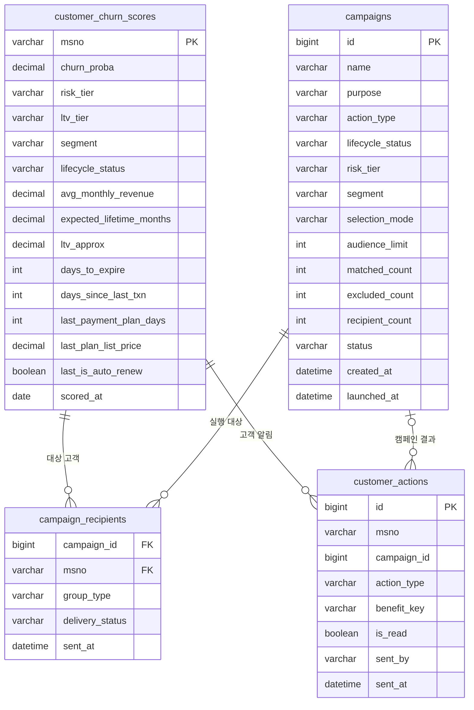

# KKBOX 이탈 예측 서빙 DB — ERD 및 실행 가이드

대상 DB는 MySQL `kkbox_serving`입니다. 원본 `members`, `transactions`, `user_logs`, `train` CSV는 적재하지 않고 모델 예측 결과, 대시보드 참조 데이터, 서비스 계정과 캠페인 기록만 저장합니다.

## 1. 전체 구조



`customer_actions.campaign_id`와 `customer_actions.msno`는 서비스에서 논리적으로 연결됩니다. 실제 FK 적용 여부는 현재 스키마 및 마이그레이션 파일을 기준으로 확인합니다.

## 2. 주요 테이블

| 테이블 | 역할 |
|---|---|
| `customer_churn_scores` | 고객별 이탈확률, 위험도, 가치, 생명주기, LTV, 구독 정보 |
| `campaigns` | 캠페인 조건, 선택 방식, 요청·제외·최종 대상 수, 실행 상태 |
| `campaign_recipients` | 캠페인별 고객 선정 및 제외·처리 결과 |
| `customer_actions` | 고객에게 노출할 알림, 읽음 여부, 혜택 수령 정보 |
| `staff_accounts` | 관리자 인증 계정 |
| `model_stats` | 모델 성능 요약 |
| `shap_importance` | 주요 피처 중요도 |
| 기타 참조 테이블 | 대시보드 차트와 분석 결과 제공 |

## 3. 서비스 데이터 흐름

```text
Enhanced v2 모델 예측
→ customer_churn_scores 적재
→ 관리자가 고객 조건과 캠페인 유형 선택
→ campaigns 생성
→ 중복·부적합 고객 제외
→ campaign_recipients 확정
→ customer_actions 생성
→ 고객 페이지에서 알림 확인·읽음 처리·혜택 수령
```

현재 데모는 외부 이메일이나 푸시를 실제 발송하지 않습니다. `customer_actions`에 기록된 내용을 고객 페이지에서 보여주는 방식입니다.

## 4. DB 생성 및 마이그레이션

### 신규 환경

먼저 기본 스키마를 적용합니다.

```powershell
mysql -u root -p < backend/scoring/schema.sql
```

현재 `schema.sql`에 후속 기능 컬럼이 모두 합쳐져 있지 않을 수 있으므로 아래 마이그레이션도 순서대로 적용합니다.

```powershell
mysql -u root -p kkbox_serving < backend/scoring/migrate_campaigns.sql
mysql -u root -p kkbox_serving < backend/scoring/migrate_notifications.sql
mysql -u root -p kkbox_serving < backend/scoring/migrate_plan_fields.sql
```

### 기존 환경

DB를 덤프로 전달받은 경우 먼저 테이블과 컬럼 존재 여부를 확인하고, 적용되지 않은 마이그레이션만 실행합니다. 동일 마이그레이션을 무조건 반복 실행하지 않습니다.

```sql
USE kkbox_serving;
SHOW TABLES;
DESCRIBE customer_churn_scores;
DESCRIBE campaigns;
DESCRIBE campaign_recipients;
DESCRIBE customer_actions;
```

필수 확인 항목:

- `customer_churn_scores`: `lifecycle_status`, 요금제 관련 컬럼
- `campaigns`, `campaign_recipients`: 테이블 존재
- `customer_actions`: `campaign_id`, `is_read`, `benefit_key`

## 5. 스코어링 데이터 생성과 적재

원본 데이터와 모델 파일이 준비된 로컬 환경에서 실행합니다.

```powershell
python backend/scoring/build_scoring_table.py
python backend/scoring/export_reference_tables.py
python backend/scoring/load_to_mysql.py
```

원본 데이터와 모델 아티팩트는 대용량이므로 Git에 포함되지 않습니다. 팀 공유 저장소나 DB 덤프로 별도 전달해야 합니다.

## 6. 서버 실행 및 확인

```powershell
cd backend
uvicorn app.main:app --reload --port 8000
```

- 고객 페이지: `http://127.0.0.1:8000/`
- 관리자 페이지: `http://127.0.0.1:8000/admin-page`
- API 문서: `http://127.0.0.1:8000/docs`

확인 순서:

1. 관리자 로그인
2. 고객 검색과 캠페인 초안 추가
3. 캠페인 실행 및 이력 확인
4. 대상 고객 로그인
5. 고객 알림 표시, 읽음 처리, 혜택 수령 확인
