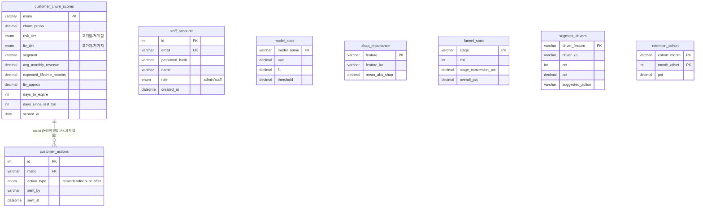

# KKBOX 이탈 예측 서빙 DB — ERD & 실행 가이드

> 대상 DB: MySQL `kkbox_serving` (커리큘럼 실습용 `kkbox` DB와는 별개)
> 이 DB에는 원본 raw csv(members/transactions/user_logs/train)는 들어가지 않는다.
> "모델 예측 결과 + 대시보드 참조 테이블 + 서비스 계정" 만 올라간다.

## 1. ERD



GitHub에서 이 파일(.md)을 열면 위 다이어그램이 자동으로 그림으로 렌더링된다.

## 2. 테이블별 설명

**`customer_churn_scores`** — 서비스의 핵심 테이블. 전체 고객(~99만 msno) 1명당 1행이며, LightGBM Enhanced v2가 계산한 이탈확률·위험/가치 세그먼트·근사 LTV가 들어있다. `msno`가 PK라 고객별로 유일하다. 관리자 페이지 고객 리스트, 고객 앱의 "내 위험도" 화면 모두 이 테이블 하나로 구성된다.

**`customer_actions`** — 관리자가 특정 고객에게 보낸 액션(리마인드, 할인 오퍼) 기록. `msno`로 `customer_churn_scores`와 논리적으로 연결되지만 실제 FK 제약은 걸려있지 않다(발표 데모용 — 실제 이메일/푸시 발송은 안 함). 고객이 로그인하면 자기한테 온 액션 내역을 여기서 조회한다.

**`staff_accounts`** — 관리자/스태프 계정. `/auth/staff-signup`으로 만들고 `/auth/staff-login`으로 로그인한다. 실제 비밀번호 해시(bcrypt)를 쓰는 유일한 테이블.

**`model_stats`, `shap_importance`, `funnel_stats`, `segment_drivers`, `retention_cohort`** — 관리자 대시보드용 참조 테이블 5개. 서로 관계없이 독립적이며, 각각 "모델 비교", "SHAP 중요도", "가입 퍼널", "세그먼트별 이탈 동인", "리텐션 코호트" 탭에 대응한다. `model_stats`는 v1/v2 파이프라인과 무관하게 LightGBM/XGBoost/CatBoost/RandomForest/LogisticRegression 알고리즘 비교표라는 점만 유의(교체 대상 아님).

## 3. 실행 순서 (재현 방법)

DB에 데이터가 들어가기까지 전체 흐름은 이렇다.

```
전처리 (preprocessing 01~06)
  -> modeling/04_feature_engineering (model_table_enhanced_v1.csv, lightgbm_enhanced_v1*)
  -> preprocessing/08_user_log_recency_enhancement (model_table_enhanced_v2.csv)
  -> modeling/05_log_recency_experiment (lightgbm_enhanced_v2*, frontend_customer_predictions.csv)
  -> backend/scoring/build_scoring_table.py       (customer_churn_scores.csv)
  -> backend/scoring/export_reference_tables.py   (참조 테이블 5개 csv)
  -> backend/scoring/load_to_mysql.py             (MySQL kkbox_serving 적재)
  -> uvicorn app.main:app --reload --port 8000    (API 기동, 프론트 연결)
```

DB 적재만 다시 하고 싶을 때(모델/피처는 이미 만들어져 있는 상태)는 아래 3줄이면 끝난다.

```bash
cd backend
python scoring/build_scoring_table.py
python scoring/export_reference_tables.py
python scoring/load_to_mysql.py
```

`load_to_mysql.py`는 매번 각 테이블을 `TRUNCATE` 하고 새로 채우기 때문에 여러 번 실행해도 데이터가 중복되지 않는다(테이블 구조/PK는 그대로 유지).

API 실행:
```bash
cd backend
uvicorn app.main:app --reload --port 8000
```
Swagger UI: `http://localhost:8000/docs` — 모든 엔드포인트를 여기서 바로 테스트할 수 있다.

## 4. 고객 로그인 방식

고객용 로그인은 비밀번호가 없는 **"체험 로그인"** 이다.

1. 고객 프론트(`kkbox_customer.html`)에서 msno를 입력하면 `POST /auth/customer-demo-login`을 호출한다.
2. 백엔드는 그 msno가 `customer_churn_scores` 테이블에 존재하는지만 확인한다 (`SELECT msno FROM customer_churn_scores WHERE msno = :msno`). 비밀번호 검증 없음.
3. 존재하면 `{"sub": msno, "type": "customer"}`를 담은 JWT를 발급한다 (`app/auth.py`의 `create_token`).
4. 이후 `/me/risk`, `/me/actions` 같은 고객 전용 엔드포인트는 이 토큰을 Bearer로 받아 `require_customer` 의존성으로 검증하고, 토큰 안의 `sub`(msno)로 본인 데이터만 조회한다.

즉 이미 프론트-백엔드 다 구현/연결돼 있는 상태다. 테스트하려면 `customer_churn_scores.csv`(또는 방금 적재한 DB)에서 아무 msno나 하나 복사해서 고객 로그인 폼에 넣어보면 된다 — 실제 KKBOX 회원 msno라 비밀번호 없이도 존재 여부만으로 로그인되는 구조를 그대로 보여주면 팀원들도 이해하기 쉬울 것 같다.
