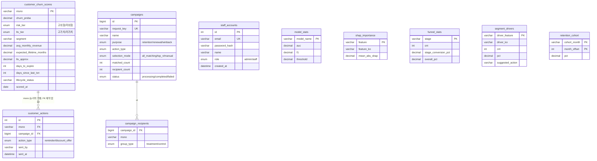

# KKBOX 구독 이탈 예측 및 리텐션 지원 시스템

> SKN34 2차 프로젝트 · 2team (저장소명 `SKN34-2nd-2team` 기준)

---

## 1. 팀 소개

> 아래 팀명/팀원 정보는 실제 팀 구성에 맞게 채워 넣어 주세요 (자동으로 알아낼 수 없는 정보라 비워둡니다).

| 이름 | 역할 | GitHub |
|---|---|---|
| (팀명: ______) | | |
| 이름1 | | @github-id |
| 이름2 | | @github-id |
| 이름3 | | @github-id |
| 이름4 | | @github-id |

---

## 2. 프로젝트 개요

### 프로젝트명
KKBOX 구독 이탈 예측 및 리텐션 지원 시스템 (가제 — 발표 시 확정 필요)

### 프로젝트 소개
대만의 음악 스트리밍 서비스 KKBOX가 공개한 실제 구독 데이터([Kaggle — WSDM KKBox's Churn Prediction Challenge](https://www.kaggle.com/competitions/kkbox-churn-prediction-challenge/data), 2015~2017)를 활용해 고객의 구독 이탈 확률을 예측하고, 그 예측 결과를 실제로 쓸 수 있는 형태(관리자 콘솔 + 고객 앱)까지 서비스로 구현한 프로젝트입니다. 단순히 모델을 학습하는 데서 끝나지 않고, EDA → 전처리/피처엔지니어링 → 모델링/튜닝 → 비즈니스 분석(리텐션·퍼널·LTV·SHAP·세그멘테이션·생존분석·A/B 테스트 설계) → MySQL 서빙 DB 적재 → FastAPI 백엔드 → React 프론트엔드(관리자용/고객용)까지 데이터 파이프라인 전체를 관통합니다.

### 프로젝트 필요성 (배경)
구독형 서비스에서는 신규 가입자를 늘리는 것 못지않게 기존 고객의 이탈을 막는 것이 매출에 직접적인 영향을 줍니다. 이 프로젝트는 다음 문제의식에서 출발합니다.

- 전체 고객(약 99.3만 명의 라벨된 유저) 중 실제 이탈률은 6.39%로 낮은 편이라, 단순 정확도만으로는 이탈 고객을 걸러낼 수 없다 (모두 "잔존"으로 예측해도 정확도 93.6%가 나오는 불균형 문제).
- 누가 이탈할지 아는 것만으로는 부족하고, "왜" 이탈 위험이 높은지(SHAP), "어떤 고객군에 어떤 액션을 취해야 하는지"(세그멘테이션 · LTV)까지 연결되어야 실무에서 쓸 수 있다.
- 예측 결과가 노트북 안에만 있으면 실제 상담원/운영자가 활용할 수 없으므로, 실제 조회·발송이 가능한 관리자 콘솔과, 고객이 자신의 혜택을 확인할 수 있는 고객 앱까지 만들어야 한다.

### 프로젝트 목표
1. 대용량 원본 데이터(user_logs만 약 30GB/3.9억 행)를 리키지 없이 안전하게 피처화한다 (관측 기준일 2017-01-31 이전 정보만 사용).
2. 여러 모델(LightGBM, XGBoost, CatBoost, RandomForest, LogisticRegression, 딥러닝 MLP)을 동일 조건에서 비교해 근거 있는 모델을 선정한다.
3. 예측 확률을 실제 운영에 쓸 수 있는 위험군(고위험/저위험) × 가치군(고가치/저가치) 세그먼트로 변환하고, SHAP 기반 이탈 동인·A/B 테스트 설계까지 연결한다.
4. 예측 결과를 MySQL 서빙 DB에 적재하고, FastAPI + React 기반 관리자 콘솔(고객 탐색/캠페인 발송)과 고객 앱(내 위험도, 맞춤 혜택, 구독 결제)으로 서비스화한다.

---

## 3. 기술 스택

**데이터 분석 / 모델링**
- Python, pandas, numpy, scikit-learn
- LightGBM, XGBoost, CatBoost, RandomForest, LogisticRegression (모델 비교)
- PyTorch (딥러닝 MLP 베이스라인 비교용, `requirements-extra.txt`)
- Optuna (하이퍼파라미터 튜닝, TPESampler)
- SHAP (모델 설명력/XAI)
- DuckDB (대용량 CSV SQL 검증 및 피처 마트)
- lifelines 계열 생존분석(Kaplan-Meier, Cox 비례위험모형) — `analytics/09_survival_analysis.ipynb`에서 사용됨. *(주의: 이 패키지는 `requirements.txt`/`requirements-extra.txt` 어디에도 명시돼 있지 않아, 재현 시 별도 설치가 필요합니다 — 발표 전 확인 권장)*

**대시보드**
- Streamlit, Plotly (`streamlit_app/` — EDA/모델비교/SHAP/리텐션/퍼널/LTV/세그멘테이션/A-B테스트 8개 페이지)

**백엔드**
- FastAPI, Uvicorn
- SQLAlchemy, PyMySQL (MySQL 연동)
- python-jose(JWT), passlib + bcrypt(해시) — 단, 고객 로그인은 비밀번호 없는 "체험 로그인"(msno 존재 여부만 확인)이고, 스태프 로그인만 실제 bcrypt 해시 검증을 사용
- python-dotenv

**프론트엔드**
- React 18.3.1 (UMD 번들을 HTML에 직접 인라인, 별도 빌드 단계 없음) + `htm` 라이브러리로 JSX 없이 태그드 템플릿 문법 사용
- 순수 CSS(커스텀 프로퍼티 기반 다크/라이트 테마), 외부 CSS 프레임워크 없음
- `kkbox_customer.html`(고객 앱), `kkbox_admin.html`(관리자 콘솔) — 각각 단일 HTML 파일로 완결

**DB**
- MySQL (`kkbox_serving` 스키마: `customer_churn_scores`, `customer_actions`, `staff_accounts`, `model_stats`, `shap_importance`, `funnel_stats`, `segment_drivers`, `retention_cohort`, `campaigns`, `campaign_recipients`)

---

## 4. WBS

> 아래 순서는 각 산출물 파일의 최종 수정 시각(파일시스템 mtime) 기준으로 추정한 대략적인 진행 순서입니다. 팀 실제 협업 일정과 다를 수 있으니 발표 전 팀원들과 맞춰 확정해 주세요.

| 단계 | 주요 산출물 | 비고 |
|---|---|---|
| 1. 환경/스캐폴딩 | `requirements.txt`, `streamlit_app/Home.py`, 초기 `README.md` | 프로젝트 초기 세팅 |
| 2. 모델 베이스라인 & 튜닝 | `modeling/01_lightgbm_baseline`, `02_optuna_tuning` | LightGBM 베이스라인 후 Optuna 25회 튜닝 |
| 3. 백엔드 스캐폴딩 | `backend/db.py`, FastAPI 앱 초기화 | DB 연결 계층 우선 구축 |
| 4. EDA | `EDA/` 4개 노트북 (members/train/transactions/user_logs) | 데이터 품질 이슈 및 분포 파악 |
| 5. 전처리/피처엔지니어링 | `preprocessing/` 01~08 | split → 소스별 피처화 → 병합 → 결측 대체 → 검증 → 로그 최근성 강화(v2) |
| 6. 모델 비교 & 고도화 | `modeling/03_model_comparison`, `04_feature_engineering`(enhanced v1), `05_log_recency_experiment`(enhanced v2) | 5개 모델 비교 후 파생피처로 2차 고도화 |
| 7. 딥러닝 비교 실험 | `dl_modeling/01_mlp_baseline`, `02_mlp_tuning` | LightGBM과 공정 비교를 위한 MLP 실험 |
| 8. 비즈니스 분석(Analytics) | `analytics/01~09` (SQL 검증/리텐션/퍼널/LTV/SHAP/세그멘테이션/A-B설계/오프라인 마케팅/생존분석) | 예측 결과를 실무 관점으로 해석 |
| 9. 서빙 DB 설계 & 적재 | `backend/scoring/schema.sql`, `build_scoring_table.py`, `export_reference_tables.py`, `load_to_mysql.py`, `DB_ERD_가이드.md` | 전체 인구 스코어링 후 MySQL 적재 |
| 10. 백엔드 API 완성 | `backend/app/routers/*` (auth/me/admin/music) | 인증, 고객 조회, 관리자 캠페인, 음악 API |
| 11. 프론트엔드 (관리자 콘솔) | `frontend/kkbox_admin.html` | 고객 탐색, 캠페인, msno 검색 |
| 12. 프론트엔드 (고객 앱) | `frontend/kkbox_customer.html` | 홈/맞춤혜택/구독결제/알림, 테마·플레이어 UX 고도화 |
| 13. 발표 준비 | 본 README, 발표 PPT, 트러블슈팅 정리 | 시연/문서화 |

---

## 5. 요구사항 명세서

> 실제 구현된 기능을 기준으로 정리한 요구사항입니다 (사전 기획 문서가 저장소에 없어, 구현 코드를 근거로 역산했습니다).

### 5.1 모델링 요구사항
- REQ-M1: 피처는 관측 기준일(2017-01-31) 이전 정보만 사용해야 한다 (미래 정보 누출 금지).
- REQ-M2: train/valid/test는 유저(msno) 단위로 겹치지 않게 분할해야 한다 (stratified 70/15/15).
- REQ-M3: 통계 기반 결측치 대체(중앙값 등)는 train split에서만 계산하고 valid/test에 동일 값을 적용해야 한다.
- REQ-M4: 최소 5개 이상의 서로 다른 알고리즘 계열을 동일 피처·동일 split으로 비교해야 한다.
- REQ-M5: 모델 선택 기준은 AUC뿐 아니라 PR-AUC, F1, 학습시간, 해석 가능성을 함께 고려해야 한다.

### 5.2 백엔드/서빙 요구사항
- REQ-B1: 전체 고객(약 99만 명)에 대해 이탈확률·위험군·가치군·근사LTV·생애주기 상태를 계산해 서빙 DB에 적재해야 한다.
- REQ-B2: 스코어링에 사용하는 피처는 모델 학습 시점의 `feature_cols`와 정확히 일치해야 하며, 컬럼 누락 시 조용히 넘어가지 않고 즉시 에러를 발생시켜야 한다.
- REQ-B3: 관리자 계정(`staff_accounts`)은 실제 비밀번호 해시(bcrypt)로 인증해야 한다.
- REQ-B4: 고객 로그인은 msno 존재 여부만으로 인증하는 "체험 로그인"으로 하고, JWT 발급 후 본인 데이터만 조회 가능해야 한다.
- REQ-B5: 관리자 캠페인은 전체 대상(all_matching) / 상위 N명(top_n) / 수동 선택(manual) 세 가지 대상 선정 방식을 지원해야 한다.
- REQ-B6: 관리자 고객 탐색 화면은 msno로 특정 고객을 직접 검색할 수 있어야 하며, 검색 중에는 다른 필터와 충돌하지 않아야 한다.

### 5.3 프론트엔드(고객 앱) 요구사항
- REQ-F1: 고객은 자신의 위험도/세그먼트에 맞는 맞춤 혜택을 확인할 수 있어야 한다.
- REQ-F2: 장기이탈(생애주기 상태 "장기만료") 고객에게는 복귀를 유도하는 재구독 혜택(실제 쿠폰 할인율 반영)을 제공해야 한다.
- REQ-F3: 다크/라이트 테마를 모두 지원하되, 모든 화면 요소에서 텍스트 대비가 충분히 확보되어야 한다.
- REQ-F4: 음악 재생 UI는 셔플/반복재생/구간 이동(seek)을 지원해야 한다.
- REQ-F5: 알림은 실시간 알림 패널 형태로 제공되고, 클릭 시 관련 혜택 화면으로 이동해야 한다.

### 5.4 프론트엔드(관리자 콘솔) 요구사항
- REQ-A1: 관리자는 위험군/세그먼트/생애주기 상태로 고객을 필터링해 조회할 수 있어야 한다.
- REQ-A2: 관리자는 특정 고객군(또는 개별 고객)에게 리마인드/할인 오퍼 캠페인을 발송(기록)할 수 있어야 한다.
- REQ-A3: 캠페인 실행 시점의 모집단/제외자/최종 대상자 수를 함께 저장해 나중에 "누구를 어떤 기준으로 선택했는지" 재현할 수 있어야 한다.

---

## 6. ERD

> 상세 원본은 [`DB_ERD_가이드.md`](./DB_ERD_가이드.md) 참고 (GitHub에서 열면 Mermaid 다이어그램이 자동 렌더링됩니다).



핵심 테이블은 `customer_churn_scores` 1개이며 (고객 1명당 1행, 약 99만 행), 나머지는 관리자 대시보드용 참조 테이블(모델비교/SHAP/퍼널/세그먼트동인/리텐션코호트)과 캠페인 발송 이력 테이블입니다. **raw 원본 CSV(members/transactions/user_logs/train)는 서빙 DB에 올라가지 않으며**, "모델 예측 결과 + 참조 테이블 + 계정"만 적재됩니다.

---

## 7. 주요 프로시저 (핵심 처리 절차)

### 7.1 전체 파이프라인 (재현 순서)
```
data/raw/ (원본 5개 CSV, members/transactions/user_logs/train)
  → EDA/ (데이터 탐색, 4개 노트북)
  → preprocessing/01~08 (유저 단위 split → 소스별 피처화 → 병합 → 결측 대체 → 검증 → 로그 최근성 강화)
  → modeling/01~05, dl_modeling/01~02 (LightGBM 베이스라인 → Optuna 튜닝 → 5개 모델 비교 → 파생피처 v1 → 로그최근성 v2 → MLP 비교)
  → analytics/01~09 (SQL 검증, 리텐션/퍼널/LTV, SHAP, 세그멘테이션, A/B 설계, 오프라인 마케팅, 생존분석)
  → backend/scoring/build_scoring_table.py   (전체 인구 스코어링 → customer_churn_scores.csv)
  → backend/scoring/export_reference_tables.py (참조 테이블 5종 csv)
  → backend/scoring/load_to_mysql.py         (MySQL kkbox_serving 적재, 매번 TRUNCATE 후 재적재)
  → uvicorn app.main:app --reload --port 8000 (API 기동)
  → frontend/kkbox_admin.html, kkbox_customer.html (브라우저에서 직접 오픈, 별도 빌드 불필요)
```

### 7.2 고객 스코어링 절차 (`build_scoring_table.py`)
1. `lightgbm_enhanced_v2.txt` 모델과 `lightgbm_enhanced_v2_meta.json`의 `feature_cols`(57개)를 로드 — 학습 시점과 컬럼이 하나라도 다르면 즉시 에러.
2. `model_table_enhanced_v2.csv`를 10만 행씩 청크로 읽어 메모리 절약하며 전체 인구의 이탈확률(`churn_proba`)을 예측.
3. msno별로 최신 스냅샷 1건만 남김(중복 제거).
4. 거래 피처(`features_transactions.csv`)로부터 월평균 매출(`avg_monthly_revenue`)을 계산하고, `expected_lifetime_months = 1 / churn_proba`(1~60개월 캡)로 근사 LTV 산출.
5. `risk_tier`(threshold=0.2708 기준 고위험/저위험) × `ltv_tier`(월매출 중앙값 기준 고가치/저가치)로 4분면 세그먼트 분류.
6. `days_to_expire` 기준으로 생애주기 상태(구독활성/갱신유예기간/장기만료/상태확인필요)를 순수 후처리로 분류.
7. `customer_churn_scores` 스키마에 맞춰 최종 컬럼만 정리해 CSV로 저장.

### 7.3 캠페인 발송 절차 (관리자 콘솔 → `POST /admin/campaigns`)
- 대상 선정 방식 3가지: `all_matching`(조건에 맞는 전원), `top_n`(위험도 상위 N명), `manual`(관리자가 개별 선택).
- 실행 시점의 모집단 수(matched_count), 최근 접촉으로 제외된 인원(excluded_count), 최종 발송 대상(recipient_count)을 함께 저장해 나중에 "누구를, 어떤 기준으로, 왜" 선택했는지 재현 가능.
- 개별 고객 대상 발송은 더 이상 `POST /admin/customers/{msno}/actions`(레거시, 현재 프론트에서 미사용)를 거치지 않고, 캠페인 API에 `selection_mode="manual"`로 통합되어 있음.

---

## 8. 수행결과 (테스트 및 시연 페이지, 캡처본)

> 실제 캡처 이미지는 저장소에 없어 이 문서에는 넣지 못했습니다 — 시연 화면을 캡처해서 이 섹션에 붙여 넣어 주세요. 아래는 실제로 구현되어 시연 가능한 화면 목록입니다.

**관리자 콘솔 (`kkbox_admin.html`)**
- 로그인(스태프 계정, bcrypt 인증)
- 대시보드: 모델 비교표, SHAP 중요도, 리텐션 코호트, 퍼널, 세그먼트별 이탈 동인
- 고객 탐색(`ActionCenter`): 위험군/세그먼트/생애주기 필터 + **msno 직접 검색**(검색 시 다른 필터 비활성화)
- 캠페인: 대상 선정(전체/상위 N/수동) → 발송 → 이력 조회

**고객 앱 (`kkbox_customer.html`)**
- msno 로그인(체험 로그인, 항상 라이트 테마로 고정)
- 홈: 최신 음악 미리보기, 내 위험도 요약
- 맞춤 혜택: 세그먼트별 혜택(고객 친화적 문구로 노출), 장기이탈 고객 대상 재구독 유도 카드
- 구독 결제(Billing): 요금제 목록, 복귀 고객 대상 실제 쿠폰 할인율 반영가
- 알림: 벨 아이콘 클릭 시 SNS 스타일 알림 패널, 클릭 시 관련 혜택으로 이동
- 플레이어: 셔플/반복재생/구간 이동(seek), 다크/라이트 테마 전환

**Streamlit 대시보드 (`streamlit_app/`)**
- EDA 개요 / 모델 비교 / SHAP 설명력 / Retention & Cohort / Funnel / LTV & Priority / 세그멘테이션 / A/B 테스트 설계, 총 8개 페이지

---

## 9. 한 줄 회고

> 팀원 각자 한 줄씩 채워 주세요.

- 이름1:
- 이름2:
- 이름3:
- 이름4:

---

## 10. 트러블슈팅

전체 트러블슈팅 목록은 [`TROUBLESHOOTING.md`](./TROUBLESHOOTING.md)에 상세히 정리했습니다. (모델링·데이터 파이프라인 단계의 이슈와, 프론트/백엔드 UI 개발 과정에서 실제로 겪은 이슈를 모두 포함합니다.)

---

## 부록: 알려진 이슈 / 향후 개선 아이디어

- `models/model_comparison.csv` 파일의 수치(예: LightGBM test AUC 0.9915)가 이 파일을 생성하는 `modeling/03_model_comparison.ipynb` 노트북 자신이 실제로 출력한 값(LightGBM test AUC 0.9011)과 다릅니다. 원인은 아직 특정하지 못했으며, 이 README/PPT/트러블슈팅 문서에서는 노트북이 직접 출력한(내부적으로 앞뒤가 맞는) 값을 사용했습니다. 발표 전 노트북을 재실행해 파일을 갱신하는 것을 권장합니다. 자세한 내용은 [`TROUBLESHOOTING.md`](./TROUBLESHOOTING.md)의 A-10 참고.
- `streamlit_app/data/ltv_summary.json`의 `risk_threshold`(0.35498, 구 베이스라인 LightGBM 기준)와 실제 서빙 백엔드 `build_scoring_table.py`가 쓰는 threshold(0.2708, LightGBM enhanced v2 기준)가 서로 다릅니다. 대시보드가 모델 v1→v2 전환 이전에 만들어진 산출물을 그대로 쓰고 있을 가능성이 있어, 발표 전 두 수치 중 어느 것을 기준으로 세그먼트 인원수를 안내할지 팀 내 확인이 필요합니다.
- `analytics/09_survival_analysis.ipynb`에서 사용한 생존분석 패키지가 `requirements.txt`/`requirements-extra.txt`에 명시되어 있지 않아, 재현 환경에서 별도 설치가 필요합니다.
- 고객 로그인에 간단한 고객ID/고정 비밀번호를 추가하는 아이디어를 검토했으나, 원본 데이터에 애초에 로그인 자격증명이 없었고 `customer_churn_scores` 테이블이 파이프라인 재실행마다 전체 TRUNCATE·재적재되는 구조라 복잡도만 커진다고 판단해 도입하지 않기로 결정했습니다.
