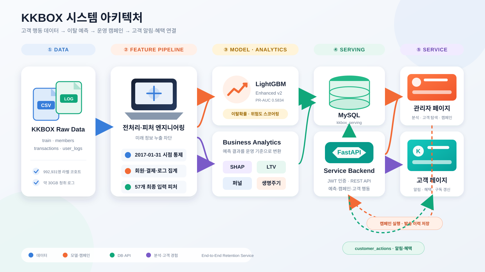
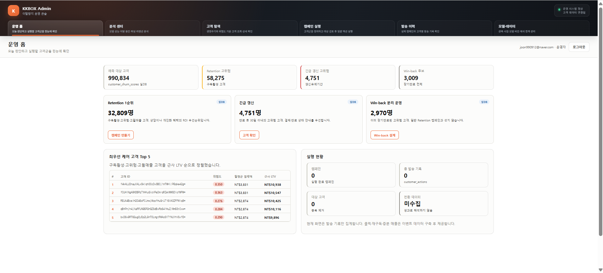
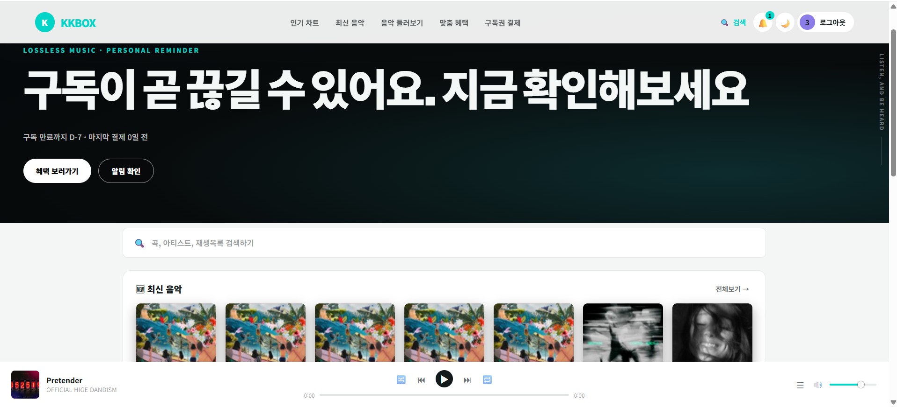

# KKBOX 고객 이탈 예측 및 리텐션 운영 시스템

> 과거 고객 행동으로 구독 이탈 위험을 예측하고, 고객 선별부터 캠페인 실행과 고객 알림까지 연결한 End-to-End 데이터 프로젝트

## 목차

| | |
|---|---|
| 1. [팀 소개](#팀-소개) | 11. [세그먼트와 캠페인](#세그먼트와-캠페인) |
| 2. [사용 기술](#tech-stack) | 12. [서비스 기능](#서비스-기능) |
| 3. [WBS](#wbs) | 13. [서비스 구현 및 배포](#서비스-구현-및-배포) |
| 4. [요구사항 명세](#requirements) | 14. [DB 구조](#db-구조) |
| 5. [핵심 결과](#핵심-결과) | 15. [서비스 시연](#service-demo) |
| 6. [문제 정의](#문제-정의) | 16. [분석·모델링 시각화 자료](#analysis-reports) |
| 7. [시스템 구조](#시스템-구조) | 17. [실행 방법](#실행-방법) |
| 8. [데이터와 예측 시점](#데이터와-예측-시점) | 18. [한계와 향후 개선](#한계와-향후-개선) |
| 9. [데이터 처리 흐름](#데이터-처리-흐름) | 19. [관련 문서](#문서) |
| 10. [모델과 성능](#모델과-성능) | |

## 팀명: 팀 노민환

<p align="center">
  
</p>

## 팀 소개

| 구분 | 임형준 | 문성호 | 송승재 | 노민환 |
|:---:|:---:|:---:|:---:|:---:|
| 프로필 |  |  |  |  |
| 담당 | ML·DL 모델링<br>고객 페이지 구현<br>FastAPI·음악 API<br>모델 결과 검증<br>서비스 안정화<br>관리자 캠페인 | 시점 누출 개선<br>EDA·전처리<br>ML·DL 모델링<br>분석 파이프라인<br>Analytics 고도화  | ML·DL 모델링<br>생존분석<br>고객 세그먼트 분석<br>마케팅 전략 도출<br>Analytics 고도화 | 프로젝트 초기 구성 |
| GitHub | [](https://github.com/HyeongJjun) | [](https://github.com/MoonSungHo-D) | [](https://github.com/Genus-Jae) | [](https://github.com/minhwan123) |

<a id="tech-stack"></a>

## ⚒️ 사용 기술

| 구분 | 사용 도구 |
|:---:|:---|
| 언어 |   |
| 데이터 처리 |    |
| 머신러닝·딥러닝 |      |
| 모델 해석·시각화 |    |
| 백엔드 |     |
| 데이터베이스 |   |
| 프론트엔드 |     |
| 협업·배포 |    |

<br>

<a id="wbs"></a>

## 🗓️ WBS (Work Breakdown Structure)

| 진행 단계 | 작업 내용 | 담당 | 상태 |
|:---:|---|:---:|:---:|
| 1. 기획·설계 | 프로젝트 주제 및 이탈 기준 정의<br>서비스 시나리오·폴더 구조 설계 | 전원 | ✅ |
| 2. EDA | 회원·거래·로그 데이터 구조 확인<br>결측치·이상치·클래스 불균형 분석 | 문성호·노민환 | ✅ |
| 3. 전처리 | 2017-01-31 관측 시점 확정<br>회원·거래·로그 피처 생성 및 데이터 병합 | 문성호 | ✅ |
| 4. 모델링 | LightGBM·XGBoost·CatBoost·MLP 비교<br>파생 피처 추가 및 Enhanced v2 선정 | 문성호·송승재·임형준 | ✅ |
| 5. 데이터 분석 | SQL 교차검증, SHAP·퍼널·리텐션·LTV 분석<br>고객 세그먼트와 마케팅 전략 도출 | 송승재 | ✅ |
| 6. DB·백엔드 | MySQL 스키마·테이블 구성<br>FastAPI 인증·고객·관리자·음악 API 구현 | 임형준 | ✅ |
| 7. 서비스 구현 | 고객·관리자 페이지 구현<br>고객 탐색·캠페인 실행·고객 알림 연결 | 임형준 | ✅ |
| 8. 통합 검증·문서화 | 모델·DB·API·화면 통합 테스트<br>README·ERD·트러블슈팅 정리 | 전원 | ✅ |

<a id="requirements"></a>

## 📋 요구사항 명세

| 구분 | 핵심 요구사항 | 구현 내용 | 상태 |
|:---:|---|---|:---:|
| 데이터 | 미래 정보 없이 고객 행동 피처를 생성해야 한다. | 거래·로그를 2017-01-31까지 제한하고 고객 단위 모델 테이블 생성 | ✅ |
| 모델 | 불균형 데이터에 적합한 지표로 모델을 비교해야 한다. | ROC-AUC·PR-AUC·Precision·Recall·F1 평가 및 LightGBM Enhanced v2 채택 | ✅ |
| 분석 | 이탈확률을 고객 가치 및 행동 정보와 함께 해석해야 한다. | SHAP·LTV·생명주기·퍼널·리텐션 기반 세그먼트 분석 | ✅ |
| 관리자 | 위험 고객군을 탐색하고 캠페인을 실행할 수 있어야 한다. | 조건 검색, 일괄 선택, 대상 검토, 캠페인 실행 및 이력 조회 | ✅ |
| 고객 | 캠페인 대상 고객이 알림과 혜택을 확인할 수 있어야 한다. | 고객 로그인, 알림 읽음 처리, 쿠폰·프로모션 확인 | ✅ |
| 백엔드 | 고객·관리자 화면과 DB를 안전하게 연결해야 한다. | FastAPI·JWT·SQLAlchemy 기반 API와 MySQL 서빙 DB 구성 | ✅ |
| 재현성 | 전처리부터 서비스 실행까지 재현 가능해야 한다. | 실행 순서, 환경 설정, DB 적재 및 서버 실행 방법 문서화 | ✅ |
| 확장성 | 향후 시간 변화와 캠페인 효과를 검증할 수 있어야 한다. | 동적 스냅샷·시간 외 검증·실제 발송·A/B 테스트를 고도화 과제로 정의 | 🔜 |

## 핵심 결과

| 구분 | 결과 |
|---|---:|
| 예측 문제 | 만료 후 30일 이내 유효한 재구독이 없으면 이탈 |
| 피처 관측 종료일 | 2017-01-31 |
| 라벨 고객 | 992,931명 |
| 이탈률 | 6.39% |
| 최종 모델 | LightGBM Enhanced v2 |
| 입력 피처 | 57개 |
| Test ROC-AUC | 0.90356 |
| Test PR-AUC | 0.58343 |
| Test F1 | 0.55674 |
| 운영 임계값 | 0.270839 (Validation F1 최적) |
| 스코어링 고객 | 990,834명 |

모델 점수만 출력하는 데서 끝나지 않고 이탈 위험 고객을 `Retention`, `긴급 갱신`, `Win-back` 캠페인으로 연결하고, 실행 결과를 고객 페이지 알림으로 전달하는 흐름을 구현했습니다.

## 문제 정의

KKBOX 데이터의 이탈률은 6.39%입니다. 모든 고객을 잔존으로 예측해도 Accuracy가 약 93.6%이므로 정확도만으로 모델을 평가할 수 없습니다.

프로젝트 목표는 다음과 같습니다.

1. 미래 정보가 섞이지 않도록 예측 시점을 통제합니다.
2. 불균형 데이터에 적합한 PR-AUC, Recall, Precision, F1을 함께 평가합니다.
3. 예측 결과를 고객 세그먼트, 캠페인, 고객 알림으로 연결합니다.

## 시스템 구조

<p align="center">
  
</p>

> 원본 데이터에서 이탈 스코어링까지의 배치 파이프라인과, 관리자가 실행한 캠페인이 FastAPI·MySQL을 거쳐 고객 알림과 혜택으로 연결되는 운영 흐름을 함께 표현했습니다.

## 데이터와 예측 시점

데이터는 Kaggle [WSDM KKBox's Churn Prediction Challenge](https://www.kaggle.com/competitions/kkbox-churn-prediction-challenge/data)를 사용했습니다.

- `train.csv`: 고객 ID와 이탈 라벨
- `members.csv`: 가입 정보와 인구통계
- `transactions.csv`: 결제, 자동 갱신, 취소, 만료일
- `user_logs.csv`: 일별 음악 이용 행동

최종 학습에서는 기본 `train.csv` 코호트만 사용하고 `train_v2.csv`는 사용하지 않았습니다.

### 2017-01-31로 관측을 종료한 이유

2월 거래와 로그를 피처에 포함하면 이탈 여부가 결정되는 기간의 미래 정보를 미리 보는 누출이 발생할 수 있습니다. 모든 거래·로그 피처를 2017-01-31까지로 제한하고 이후 확정된 `is_churn`과 비교했습니다.

| Split | 고객 수 | 이탈률 |
|---|---:|---:|
| Train | 695,051 | 6.3923% |
| Validation | 148,940 | 6.3925% |
| Test | 148,940 | 6.3918% |

고객 ID 기준 stratified 70/15/15 분할을 사용했습니다.

## 데이터 처리 흐름

```text
EDA
→ 고객 단위 Train/Validation/Test 분할
→ members 피처 생성
→ transactions 피처 생성
→ user_logs 청크 집계
→ 피처 병합 및 Train 기준 결측치 대체
→ 파생 피처와 최근 로그 피처 추가
→ 모델 학습·비교·평가
→ 전체 고객 스코어링
→ MySQL 적재
→ FastAPI 및 프론트엔드 연결
```

약 30GB, 3.9억 행 규모의 `user_logs.csv`는 메모리에 한 번에 올리지 않고 청크 단위로 집계했습니다. 동일 집계를 DuckDB SQL로 교차 검증했습니다.

주요 피처:

- 고객: 도시, 가입 경로, 가입 기간, 정제 연령
- 결제: 거래 수, 자동 갱신률, 취소율, 최근 결제일, 만료일까지 남은 일수
- 이용: 최근 7·30·90일 활동일, 재생시간, 고유 곡 수
- 파생: 행동 변화, 결제 변화, 만료일 정합성, 최근 로그 경과일

## 모델과 성능

최종 모델의 로컬 기준 파일은 `models/lightgbm_enhanced_v2_meta.json`입니다. `models/`는 대용량 아티팩트 정책으로 Git에서 제외되므로 재현 환경에서는 별도로 전달해야 합니다.

| 모델 | Test ROC-AUC | Test PR-AUC | Precision | Recall | F1 |
|---|---:|---:|---:|---:|---:|
| LightGBM Enhanced v2 | 0.90356 | 0.58343 | 0.53676 | 0.57826 | 0.55674 |
| MLP | 0.89235 | 0.55990 | 0.53514 | 0.55273 | 0.54379 |

집계된 정형 데이터에서는 LightGBM이 MLP보다 모든 주요 지표에서 우수했고 SHAP 기반 설명도 가능해 최종 모델로 채택했습니다.

- ROC-AUC: 전체 고객의 이탈 위험 순위를 구분하는 능력
- PR-AUC: 희소한 이탈 고객을 정확하게 찾는 능력으로, 본 프로젝트의 주요 지표
- Precision: 이탈로 예측한 고객 중 실제 이탈 고객 비율
- Recall: 실제 이탈 고객 중 모델이 찾아낸 비율
- F1: Precision과 Recall의 균형

상위 5% 위험 고객군은 Precision 약 61.1%, Recall 약 47.8%, Lift 약 9.55배로 제한된 마케팅 자원의 우선순위 선정에 활용할 수 있습니다.

## 세그먼트와 캠페인

위험도, 월평균 결제액, 고객 생명주기를 결합해 운영 대상을 나눕니다. LTV는 구매 인과효과가 아니라 고객 가치와 자원 배분을 위한 근사 지표입니다.

| 생명주기 | 캠페인 | 실행 예시 |
|---|---|---|
| 구독 활성 | Retention | 갱신 안내, 선택적 할인 |
| 갱신 유예기간 | 긴급 갱신 | 결제·만료 안내, 기한 제한 혜택 |
| 장기 만료 | Win-back | 복귀 콘텐츠, 복귀 할인 |

관리자는 조건을 충족하는 전체 고객, 위험도 상위 N명, 고객 탐색에서 직접 추가한 고객을 대상으로 캠페인을 구성할 수 있습니다. 실행 전 중복과 목적·생명주기가 맞지 않는 고객을 제외합니다.

## 서비스 기능

### 관리자 페이지

- 운영 현황과 우선 관리 고객군
- 모델 성능, SHAP, 퍼널, 리텐션·세그먼트 분석
- 생명주기·위험도·가치·고객 ID 기반 탐색
- Retention·긴급 갱신·Win-back 캠페인 생성
- 대상 미리보기, 제외 결과, 캠페인 이력
- 모델 버전, 임계값, 데이터 해석 한계 관리

### 고객 페이지

- 고객 ID 기반 데모 로그인
- 개인 세그먼트 기반 화면과 혜택
- 관리자 캠페인 알림 조회 및 읽음 처리
- 쿠폰·프로모션·연차 혜택 수령
- 구독 요금제와 결제수단 선택
- 음악 차트, 최신 음악, 검색·플레이어

현재 데모는 실제 이메일이나 푸시를 발송하지 않고 `customer_actions`에 캠페인 결과를 기록해 고객 알림으로 보여줍니다.

## 서비스 구현 및 배포

- FastAPI가 API와 고객·관리자 HTML을 함께 제공하는 단일 배포 구조입니다.
- 프론트엔드는 `window.location.origin`을 API 기준 주소로 사용하므로 로컬과 공개 데모 환경에서 별도 주소 수정이 필요하지 않습니다.
- 관리자와 고객은 서로 다른 JWT 타입으로 인증하며, 라우터 의존성에서 권한을 구분합니다.
- 오프라인 스코어링 배치는 Enhanced v2 예측과 분석 참조 테이블을 생성한 뒤 MySQL에 적재합니다.
- 음악 검색·차트·신곡 기능은 FastAPI가 Apple 공개 API를 프록시하고 서버 메모리 캐시를 적용합니다.
- 발표용 외부 접속은 로컬 Uvicorn 서버를 Cloudflare Quick Tunnel로 노출하는 방식으로 구성할 수 있습니다.

전체 API 목록, 인증 흐름, 캠페인 시퀀스, Cloudflare 배포 과정과 Apple Music 프록시 제약은 [프로젝트 통합 상세 문서](./docs/KKBOX_프로젝트_통합문서.md)에서 확인할 수 있습니다.

## DB 구조

| 테이블 | 역할 |
|---|---|
| `customer_churn_scores` | 고객별 이탈확률, 위험도, 가치, 생명주기, LTV |
| `campaigns` | 캠페인 조건과 실행 결과 |
| `campaign_recipients` | 캠페인별 최종 대상 및 제외 결과 |
| `customer_actions` | 고객 알림, 읽음 상태, 혜택 수령 기록 |
| `staff_accounts` | 관리자 계정 |
| `model_stats`, `shap_importance` 등 | 분석 화면 참조 데이터 |

자세한 내용은 [DB ERD 및 실행 가이드](./DB_ERD_가이드.md)를 참고하세요.

<a id="service-demo"></a>

## 🖥️ 서비스 시연

<table>
  <tr>
    <th width="50%">관리자 페이지</th>
    <th width="50%">고객 페이지</th>
  </tr>
  <tr>
    <td align="center">
      <a href="./docs/DEMO.md#관리자-페이지">
        
      </a>
    </td>
    <td align="center">
      <a href="./docs/DEMO.md#고객-페이지">
        
      </a>
    </td>
  </tr>
  <tr>
    <td align="center"><a href="./docs/DEMO.md#관리자-페이지"><b>관리자 시연 전체 보기</b></a></td>
    <td align="center"><a href="./docs/DEMO.md#고객-페이지"><b>고객 시연 전체 보기</b></a></td>
  </tr>
</table>

관리자 고객 탐색·캠페인 실행부터 고객 알림·혜택 확인까지의 전체 흐름은 [서비스 시연 상세 문서](./docs/DEMO.md)에서 확인할 수 있습니다.

<a id="analysis-reports"></a>

## 📊 분석·모델링 시각화 자료

전처리 검증, 주요 그래프 해석, 모델 비교와 최종 모델 선정 근거는 아래 PDF에서 확인할 수 있습니다.

| 자료 | 포함 내용 | 보기 |
|---|---|:---:|
| 데이터 전처리 과정 | 관측 시점 설정, 원본 데이터 정제, 피처 생성·검증 및 시각화 해석 | [PDF 열기](./docs/reports/data-preprocessing.pdf) |
| 모델링 비교 결과 | ML·DL 모델 비교, 성능 지표, 최종 LightGBM Enhanced v2 선정 근거 | [PDF 열기](./docs/reports/modeling-comparison.pdf) |

## 실행 방법

### 1. 가상환경과 패키지

```powershell
python -m venv My_venv
.\My_venv\Scripts\Activate.ps1
python -m pip install -r requirements.txt
python -m pip install -r requirements-extra.txt
```

프로젝트 루트에 `.env`를 생성합니다.

```dotenv
MYSQL_HOST=127.0.0.1
MYSQL_PORT=3306
MYSQL_USER=your_user
MYSQL_PASSWORD=your_password
MYSQL_SERVING_DB=kkbox_serving
```

### 2. DB 구성

```powershell
mysql -u root -p < backend/scoring/schema.sql
mysql -u root -p kkbox_serving < backend/scoring/migrate_campaigns.sql
mysql -u root -p kkbox_serving < backend/scoring/migrate_notifications.sql
mysql -u root -p kkbox_serving < backend/scoring/migrate_plan_fields.sql
```

스코어링 산출물을 새로 생성하고 적재하려면 다음을 실행합니다.

```powershell
python backend/scoring/build_scoring_table.py
python backend/scoring/export_reference_tables.py
python backend/scoring/load_to_mysql.py
```

대용량 원본 데이터와 모델 파일은 Git에 포함되지 않으므로 별도로 준비해야 합니다.

### 3. 서버 실행

#### 3-1. 로컬 실행

```powershell
cd backend
uvicorn app.main:app --reload --port 8000
```

- 고객 페이지: `http://127.0.0.1:8000/`
- 관리자 페이지: `http://127.0.0.1:8000/admin-page`
- API 문서: `http://127.0.0.1:8000/docs`

프론트엔드는 현재 서버의 origin을 API 주소로 사용하므로 HTML 파일을 직접 열지 말고 FastAPI 주소로 접속해야 합니다.

#### 3-2. Cloudflare Tunnel로 외부 공개

로컬에서 실행 중인 FastAPI를 코드 수정 없이 그대로 공개 HTTPS URL로 노출할 수 있습니다. (Quick Tunnel, 계정 가입 불필요, 무료)

```powershell
# 1) cloudflared 설치 (Windows, 최초 1회)
#    https://github.com/cloudflare/cloudflared/releases/latest/download/cloudflared-windows-amd64.msi
cloudflared --version

# 2) 백엔드 먼저 실행 (터미널 1, backend 폴더에서)
cd backend
uvicorn app.main:app --port 8000

# 3) 터널 실행 (터미널 2, 새 터미널)
cloudflared tunnel --url http://localhost:8000
```

터미널에 출력되는 `https://xxxx-xxxx.trycloudflare.com` 주소로 접속합니다.

- 고객 페이지: 발급된 URL 그대로
- 관리자 페이지: 발급된 URL + `/admin-page`

> Quick Tunnel URL은 재시작할 때마다 랜덤하게 바뀝니다. 프론트 HTML만 수정한 경우 새로고침만으로 반영되고, 백엔드(.py) 수정 시에는 uvicorn만 재시작하면 되며 cloudflared 터미널은 그대로 둬도 됩니다.

자세한 배포 원리와 주의사항은 [프로젝트 통합 상세 문서 8장](./docs/KKBOX_프로젝트_통합문서.md#8-fastapi-배포-과정-cloudflare-tunnel)을 참고하세요.

## 데모 순서

1. 관리자 로그인 후 운영 현황과 우선 고객군을 확인합니다.
2. 고객 탐색에서 조건을 적용하고 캠페인 초안에 고객을 추가합니다.
3. 캠페인 실행 화면에서 대상과 제외 결과를 확인한 뒤 실행합니다.
4. 캠페인 이력에서 기록을 확인합니다.
5. 대상 고객으로 로그인해 알림과 혜택이 연결된 것을 확인합니다.

## 프로젝트 구조

```text
EDA/                 원본 테이블별 탐색
preprocessing/       시점 분할, 피처 생성, 최종 모델 테이블
modeling/            ML 베이스라인, 비교, 파생 피처, 최종 LightGBM
dl_modeling/         MLP 베이스라인과 클래스 가중치 실험
analytics/           SQL 검증, 퍼널, LTV, SHAP, 세그먼트, 생존분석
backend/app/         FastAPI 인증·고객·관리자·음악 API
backend/scoring/     스코어링, DB 스키마와 마이그레이션
frontend/            관리자 및 고객 페이지
docs/                발표 및 운영 문서
```

## 한계와 향후 개선

- 2017-01-31 기준 과거 스냅샷이므로 현재 고객 상태를 나타내지 않습니다.
- 무작위 분할 성능 외에 `train_v2` 같은 이후 코호트를 활용한 시간 외 검증이 필요합니다.
- 실제 메시지 발송과 노출·클릭·재구독·매출 이벤트는 구현하지 않았습니다.
- 캠페인 효과 평가는 대조군을 포함한 A/B 테스트와 전환 이벤트 수집이 필요합니다.
- 여러 월의 동적 스냅샷을 만들면 시계열·생존분석 기반 조기 예측으로 확장할 수 있습니다.

A/B 테스트와 시계열 고도화는 현재 구현 기능이 아니라 발표의 향후 개선 방향으로만 다룹니다.

## 문서

- [서비스 시연 화면](./docs/DEMO.md)
- [데이터 전처리 과정 PDF](./docs/reports/data-preprocessing.pdf)
- [모델링 비교 결과 PDF](./docs/reports/modeling-comparison.pdf)
- [프로젝트 통합 상세 문서](./docs/KKBOX_프로젝트_통합문서.md)
- [서빙 DB ERD 및 실행 가이드](./DB_ERD_가이드.md)
- [트러블슈팅](./TROUBLESHOOTING.md)
