# KKBOX 서비스 시연 화면

> 관리자 페이지에서 고객을 탐색해 캠페인을 실행하고, 대상 고객이 고객 페이지에서 알림과 혜택을 확인하는 흐름을 순서대로 정리했습니다.

[← README로 돌아가기](../README.md)

## 관리자 페이지

### 1. 관리자 로그인

운영자 계정으로 로그인해 관리자 콘솔에 접근합니다.

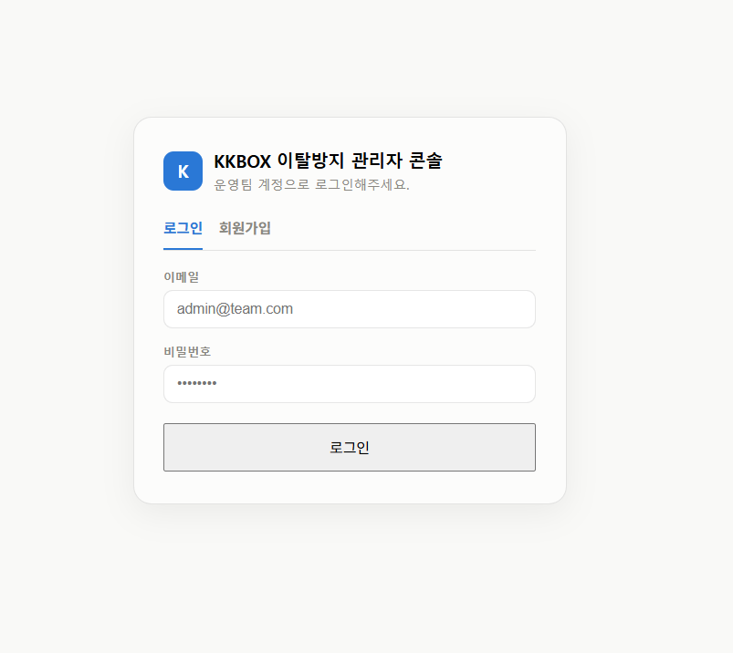

### 2. 운영 홈

예측 대상 고객과 Retention·긴급 갱신·Win-back 우선 고객군을 확인합니다.

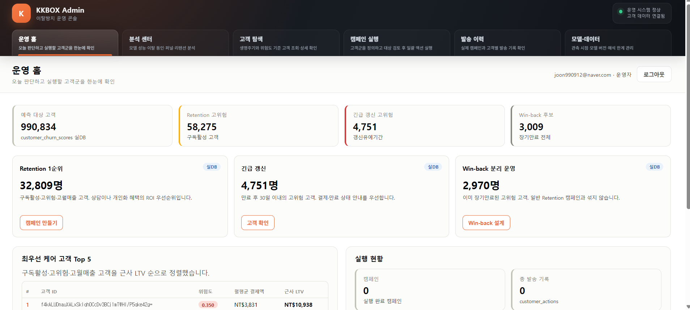

### 3. 운영 우선순위와 실행 현황

최우선 관리 고객과 캠페인 실행 현황을 한 화면에서 확인합니다.

### 4. 분석 센터

모델 성능, SHAP 이탈 요인, 행동 퍼널과 고객 세그먼트 분석을 확인합니다.

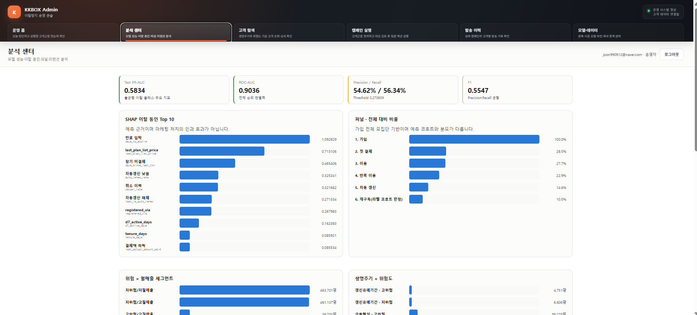

### 5. 고객 탐색

캠페인 목적, 위험도와 월매출 세그먼트로 고객을 조회하고 상세 정보를 확인합니다.

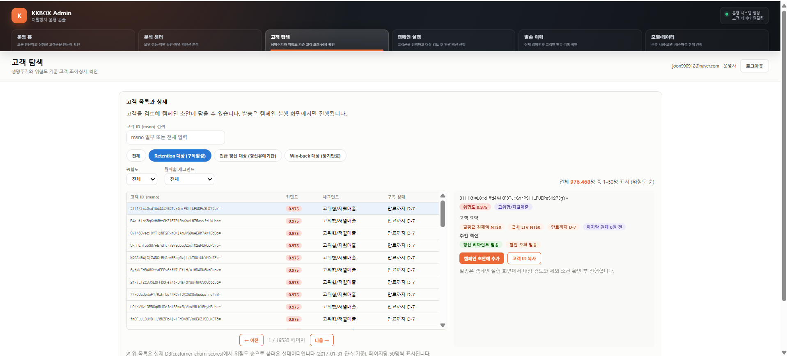

### 6. 캠페인 초안 추가

고객 상세에서 선택한 고객을 캠페인 초안에 추가합니다.

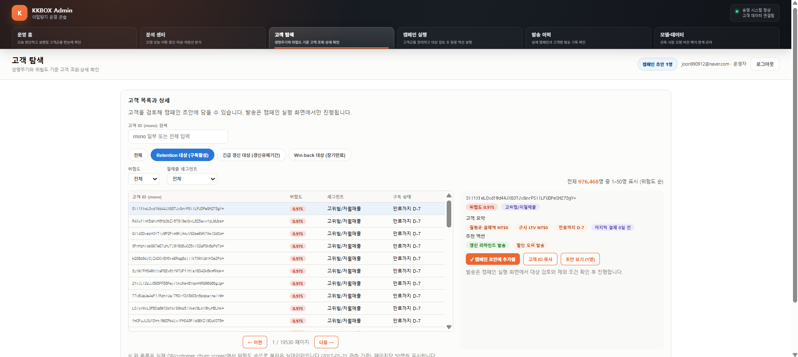

### 7. 캠페인 검토 및 실행

캠페인의 목적·대상·제외 조건을 설정하고 최종 수신 대상을 검토한 후 실행합니다.

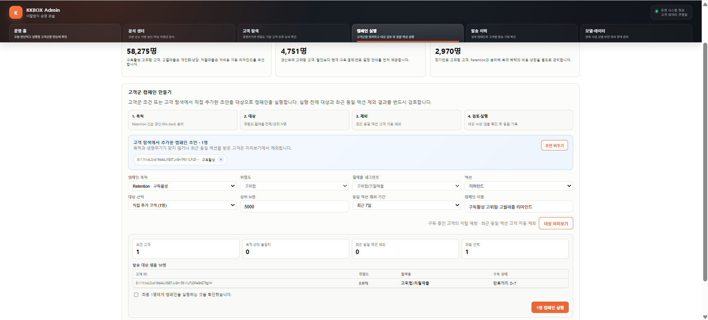

### 8. 모델 데이터

운영 모델의 버전, 입력 피처, 관측 종료일, 평가 지표와 해석상 한계를 확인합니다.

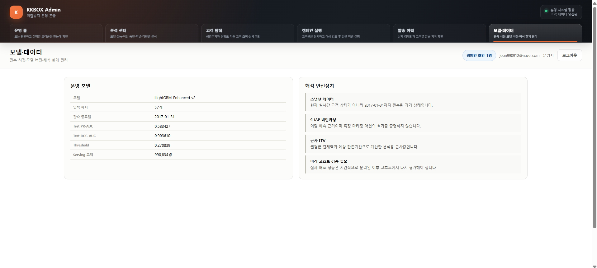

### 9. 발송 이력

실행한 캠페인과 고객별 발송 기록을 확인합니다.

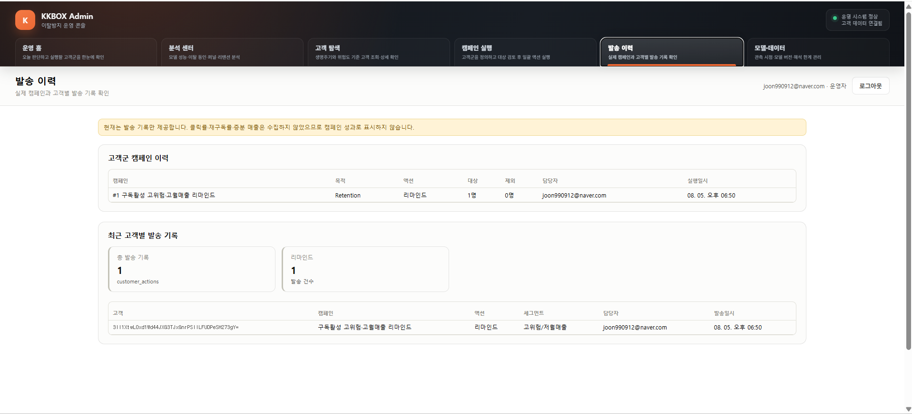

## 고객 페이지

### 1. 고객 로그인

데모 고객 ID인 `msno`를 입력해 고객 페이지에 로그인합니다.

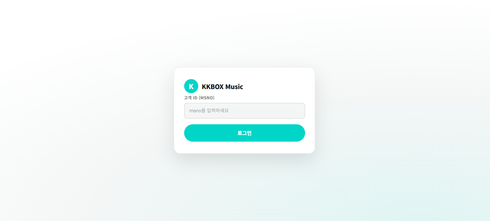

### 2. 개인화 홈

구독 상태에 맞는 메시지와 음악 콘텐츠를 확인합니다.

### 3. 캠페인 알림

관리자 페이지에서 실행한 캠페인 알림을 고객 화면에서 확인합니다.

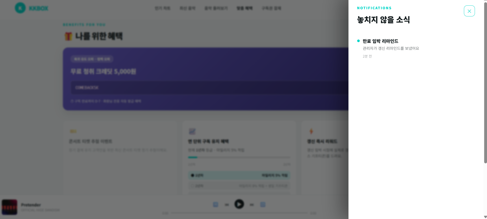

### 4. 맞춤 혜택

고객에게 발급된 청취 크레딧과 구독 유지 혜택을 확인합니다.

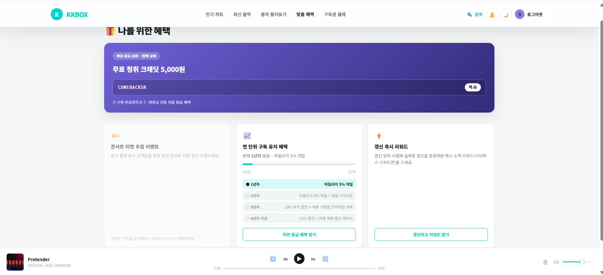

### 5. 구독권 결제

현재 구독 상태와 이용 가능한 요금제를 확인하고 갱신 흐름을 체험합니다.

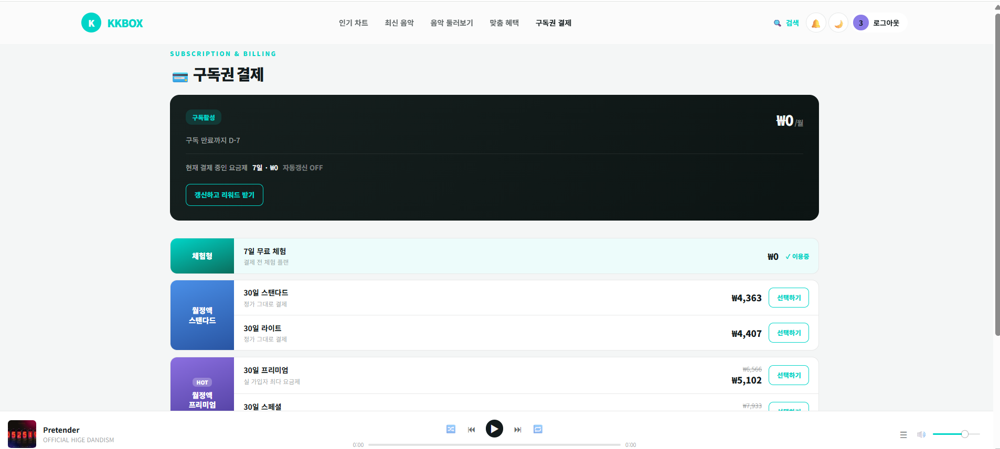

[↑ 문서 위로](#kkbox-서비스-시연-화면) · [README로 돌아가기](../README.md)

