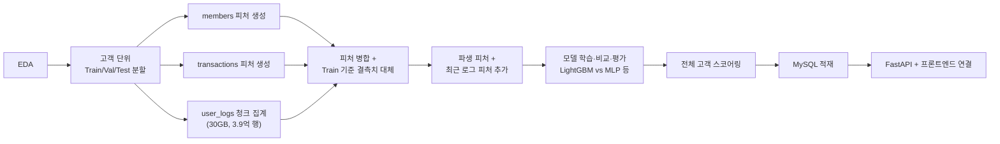
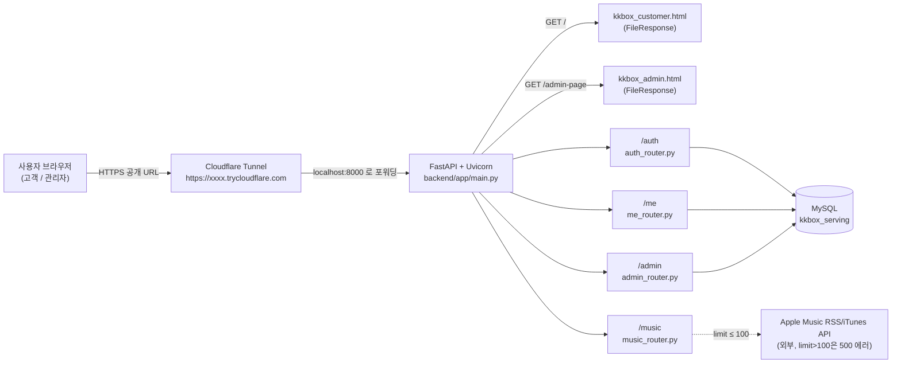
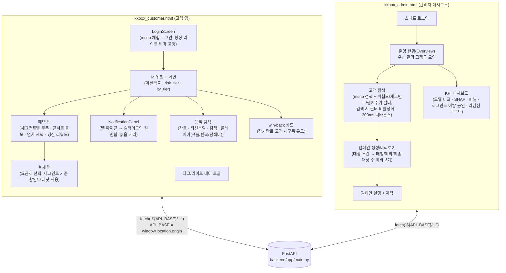
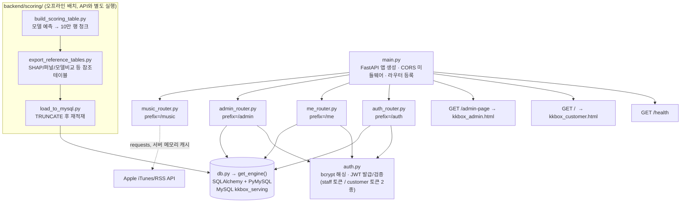
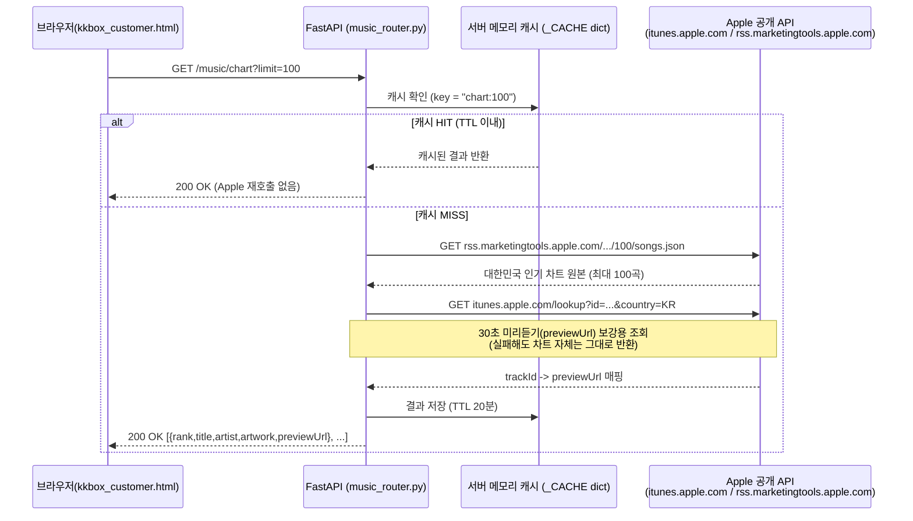
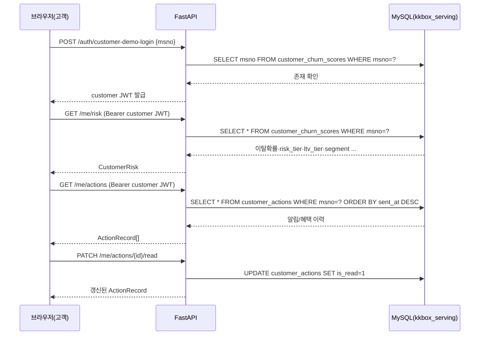
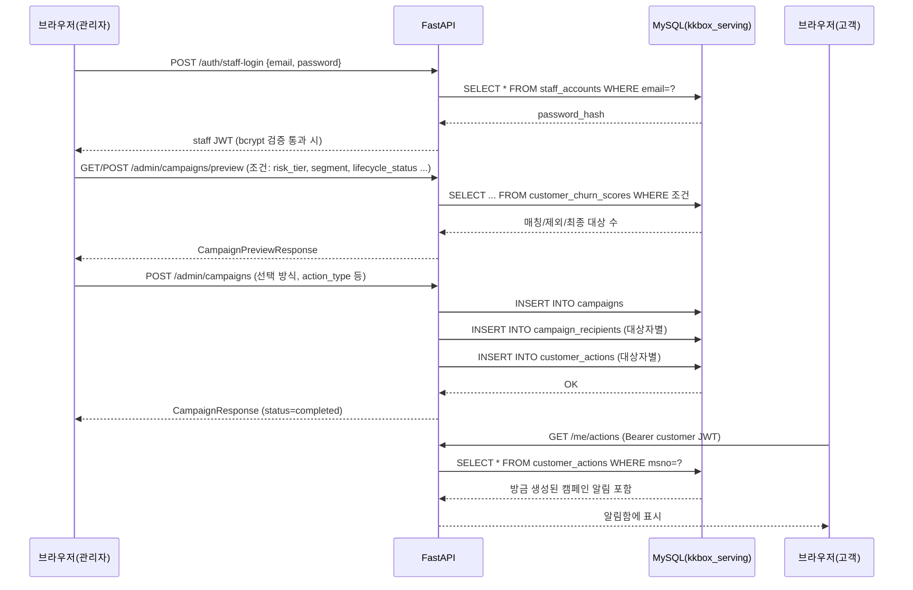
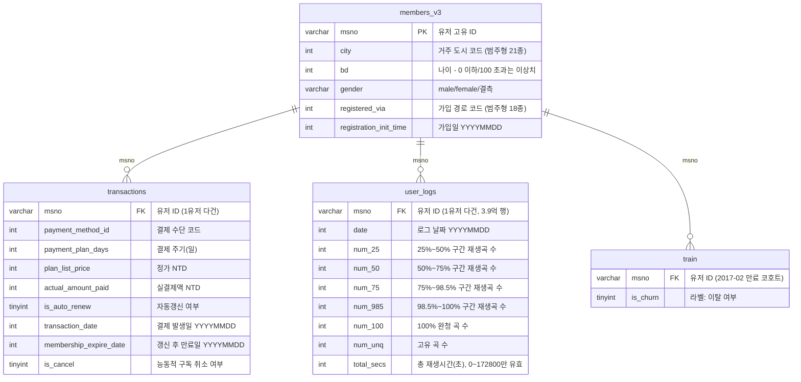
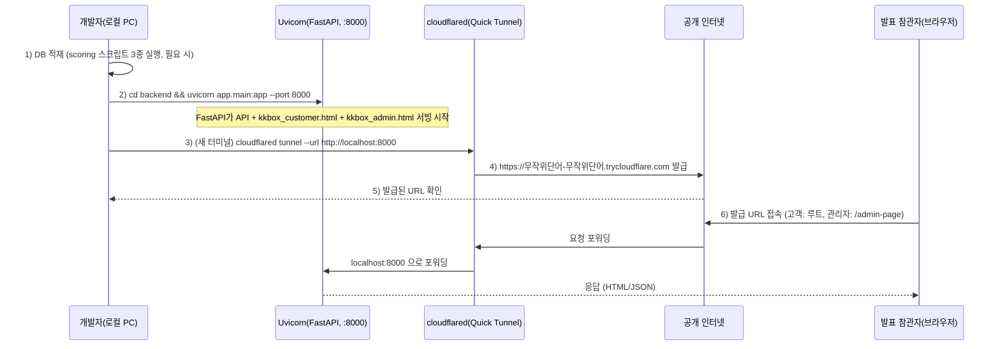

# KKBOX 이탈 예측 서비스 — 프로젝트 통합 문서

> SKN34-2nd-2team · KKBOX Customer Churn Prediction & Retention Service
> ERD, 아키텍처, 배포 과정, 계층별 다이어그램, 기능별 설명, 트러블슈팅을 한 문서로 정리했습니다.
> GitHub 등 Mermaid를 지원하는 뷰어(또는 VS Code Markdown Preview)로 열면 아래 다이어그램들이 그림으로 렌더링됩니다.
> 이 문서는 팀원이 구현한 프론트엔드·백엔드·API·배포 작업의 상세 참고 자료입니다. 프로젝트의 최종 모델 수치와 실행 기준은 `README.md`, DB 구조는 `DB_ERD_가이드.md`를 우선합니다.

---

## 목차

1. [프로젝트 개요](#1-프로젝트-개요)
2. [전체 시스템 아키텍처](#2-전체-시스템-아키텍처)
3. [프론트엔드 구조](#3-프론트엔드-구조)
4. [백엔드(FastAPI) 구조](#4-백엔드fastapi-구조)
5. [API 엔드포인트 전체 목록](#5-api-엔드포인트-전체-목록)
6. [API 흐름(시퀀스) 다이어그램](#6-api-흐름시퀀스-다이어그램)
7. [DB ERD](#7-db-erd)
8. [FastAPI 배포 과정 (Cloudflare Tunnel)](#8-fastapi-배포-과정-cloudflare-tunnel)
9. [기능별 설명](#9-기능별-설명)
10. [트러블슈팅 정리](#10-트러블슈팅-정리)
11. [참고 문서](#11-참고-문서)

---

## 1. 프로젝트 개요

KKBOX 실사용자 데이터(회원/결제/청취로그)를 기반으로 이탈(churn) 확률을 예측하고, 그 결과를 **고객용 앱**과 **관리자 대시보드** 양쪽에서 실제 서비스처럼 체험할 수 있게 만든 End-to-End 캡스톤 프로젝트입니다. 모델 점수 산출에서 끝나지 않고, 이탈 위험 고객을 캠페인으로 연결하고 그 실행 결과를 고객 알림으로 보여주는 흐름까지 구현했습니다.

| 구분 | 내용 |
|---|---|
| 예측 문제 | 멤버십 만료 후 30일 이내 유효한 재구독이 없으면 이탈 |
| 피처 관측 종료일 | 2017-01-31 (미래 정보 차단) |
| 라벨 고객 수 | 992,931명 |
| 이탈률 | 6.39% |
| 최종 모델 | LightGBM Enhanced v2 (57 피처) |
| Test ROC-AUC / PR-AUC / F1 | 0.90356 / 0.58343 / 0.55674 |
| 운영 임계값 | 0.270839 (Validation F1 최적) |
| 스코어링 고객 수 | 990,834명 |
| 고객 앱 | `frontend/kkbox_customer.html` — msno 체험 로그인 → 위험도/혜택/쿠폰/결제 |
| 관리자 대시보드 | `frontend/kkbox_admin.html` — 고객 탐색·캠페인 발송·모델 비교·SHAP·퍼널·리텐션 |
| 백엔드 | `backend/app/main.py` — FastAPI 단일 프로세스가 API + 프론트 HTML 서빙까지 담당 |
| DB | MySQL `kkbox_serving` — raw CSV는 적재하지 않고 예측 결과 + 참조 테이블만 적재 |

### 데이터 처리 흐름 (모델링 파이프라인)



---

## 2. 전체 시스템 아키텍처



**핵심 설계 포인트 3가지**

- **단일 배포 단위**: FastAPI가 API와 프론트 HTML을 모두 서빙(`FileResponse`)하고, `kkbox_customer.html`은 `const API_BASE = window.location.origin;`을 사용하기 때문에 **CORS 설정이 필요 없다**. Cloudflare Tunnel처럼 접속 URL이 매번 바뀌는 환경에도 코드 수정 없이 그대로 배포된다.
- **DB는 MySQL 하나**: `kkbox_serving`. raw CSV(members/transactions/user_logs/train)는 여기 들어가지 않고, 모델이 계산한 결과 + 대시보드 참조 테이블 + 계정만 올라간다.
- **Apple Music API 제약**: `limit>100`이면 Apple 서버가 100% 재현되는 HTTP 500을 반환한다는 것을 실제 테스트로 확인해서, 내부 호출·공개 파라미터 상한 모두 100으로 고정해뒀다 (10장 참고).

---

## 3. 프론트엔드 구조

두 화면 모두 **단일 HTML 파일에 React 18(UMD) + JSX를 인라인**한 구조입니다. 별도 빌드 단계(Vite/CRA 등) 없이 `FileResponse`로 그대로 서빙되며, 배포 환경이 바뀌어도(로컬 ↔ Cloudflare Tunnel) 코드 수정이 필요 없습니다.




---

## 4. 백엔드(FastAPI) 구조



- **인증**: `auth.py`가 두 종류의 JWT를 발급합니다 — `{"type":"staff","sub":email,"role":"admin"|"staff"}`(운영자), `{"type":"customer","sub":msno}`(고객, 체험 로그인). 라우터에서는 `require_staff` / `require_customer` 의존성으로 구분해서 막습니다.
- **DB 커넥션**: `db.py`가 `.env`(`MYSQL_HOST/PORT/USER/PASSWORD/MYSQL_SERVING_DB`)를 읽어 SQLAlchemy 엔진을 `lru_cache`로 재사용합니다. `.env`가 없으면 기본값(`127.0.0.1:3306`, `root`, DB명 `kkbox_serving`)을 씁니다.
- **재적재 구조**: `customer_churn_scores`는 `load_to_mysql.py` 실행 시마다 `TRUNCATE` 후 CSV에서 전량 재적재됩니다. 반면 `staff_accounts`/`customer_actions`/`campaigns`/`campaign_recipients`는 이 재적재 대상에서 제외됩니다(코드 주석으로 명시된 의도적 설계).

### 4-1. Apple Music API 프록시 라우팅 (`music_router.py`)

`kkbox_serving` DB와는 무관한 **공개 음원 메타데이터**를 다루는 라우터라서 로그인 여부와 상관없이 열려 있습니다(`require_staff`/`require_customer` 의존성 없음). 브라우저가 Apple 서버를 직접 호출하지 않고 **FastAPI가 대신 호출해서 결과를 그대로/가공해서 돌려주는 프록시 구조**입니다.

**프록시를 두는 이유**

- 브라우저(`kkbox_customer.html`)가 `itunes.apple.com`/`rss.marketingtools.apple.com`을 직접 `fetch()`하면 사용자 네트워크 환경(회사/학교 방화벽, 브라우저 정책 등)에 따라 CORS나 차단 이슈가 생길 수 있습니다.
- 백엔드가 대신 호출하면 브라우저는 **항상 같은 오리진(`localhost:8000` 또는 배포된 Cloudflare Tunnel 주소)만** 호출하므로 CORS 문제 자체가 발생하지 않습니다 (2장에서 설명한 "단일 배포 단위" 원칙과 동일한 이유).
- 서버 메모리 캐시를 얹어 Apple 쪽 레이트리밋이나 일시 장애가 발표 도중 발생해도 화면이 죽지 않도록 방어합니다.



**엔드포인트별 라우팅 상세**

| 엔드포인트 | 실제로 호출하는 Apple API | limit 상한 | 캐시 TTL | 비고 |
|---|---|---|---|---|
| `GET /music/search` | `itunes.apple.com/search` (검색어 그대로 프록시) | 200 | 6시간 | `term+limit` 조합별로 캐시 키 구성. 검색어가 대부분 고정 문자열(컴백/추천 쿼리)이라 길게 캐시해도 무방 |
| `GET /music/chart` | `rss.marketingtools.apple.com/api/v2/kr/music/most-played/{limit}/songs.json` + `itunes.apple.com/lookup`(미리듣기 보강) | **100 (강제 상한)** | 20분 | 응답을 `{rank, title, artist, artwork, previewUrl}` 형태로 가공해서 반환 |
| `GET /music/new-releases` | 위와 동일 소스(인기 차트 100곡)를 가져온 뒤 **정렬 기준만 인기순 → `releaseDate`순으로 재정렬** | **100 (강제 상한)** | 20분 | Apple 공개 API에는 별도 "신곡" 전용 피드가 없어(직접 테스트로 404 확인), 인기 차트를 재사용하는 방식으로 대체 |

**limit 상한을 100으로 고정한 이유 (10장 트러블슈팅 4번 참고)**: `rss.marketingtools.apple.com` 피드는 `limit>100`(예: 150, 200)으로 요청하면 **타임아웃이 아니라 100% 재현되는 HTTP 500**을 반환한다는 것을 실제 API 호출로 직접 확인했습니다. 그래서 백엔드 내부 호출값과 `Query(..., le=100)`으로 걸어둔 공개 파라미터 상한을 모두 100으로 고정해뒀습니다. (반면 `/music/search`가 쓰는 `itunes.apple.com/search`는 이 제약이 없어 `le=200`까지 허용합니다.)

**그 외 안전장치**

- `_get_with_retry()`: 순수 네트워크 불안정(일시적 타임아웃/커넥션 오류)에 대비한 1회 재시도. limit>100 500 에러는 재시도로 해결되는 문제가 아니라서 별개로 `limit=100` 상한을 걸어 원천 차단.
- `TIMEOUT = 6`초: 발표 시연 중 Apple 쪽 응답이 느려도 화면이 무한정 멈추지 않도록 짧게 설정.
- 캐시는 프로세스 메모리(`dict`)에만 두는 단순 구조라 서버 재시작 시 비워지지만, 데모 목적에는 이 정도로 충분해 Redis 등 외부 캐시는 도입하지 않음.

---

## 5. API 엔드포인트 전체 목록

| Method | 경로 | 인증 | 설명 |
|---|---|---|---|
| GET | `/health` | - | 헬스체크 |
| GET | `/` | - | 고객 사이트(`kkbox_customer.html`) 서빙 |
| GET | `/admin-page` | - | 관리자 사이트(`kkbox_admin.html`) 서빙 |
| POST | `/auth/staff-signup` | - | 운영자 회원가입 (email/password/name) → staff JWT 발급 |
| POST | `/auth/staff-login` | - | 운영자 로그인 (bcrypt 검증) → staff JWT 발급 |
| POST | `/auth/customer-demo-login` | - | 고객 체험 로그인 — 실제 비밀번호 없이 `customer_churn_scores`에 존재하는 msno인지만 확인 |
| GET | `/me/risk` | customer | 로그인한 고객 본인의 위험도/LTV 1건 조회 |
| GET | `/me/actions` | customer | 관리자가 보낸 알림 + 내가 직접 받은 혜택 목록 |
| PATCH | `/me/actions/{action_id}/read` | customer | 알림 1건 읽음 처리 |
| POST | `/me/actions/read-all` | customer | 알림 전체 읽음 처리 |
| POST | `/me/benefits/claim` | customer | 콘서트 응모/연차 혜택/갱신 리워드 셀프 수령 (동일 benefit_key 중복 방지) |
| GET | `/admin/customers` | staff | 고객 탐색 — msno 검색 또는 위험도/세그먼트/생애주기 필터 |
| GET | `/admin/kpis` | staff | KPI 요약 |
| GET | `/admin/overview` | staff | 운영 현황 요약 |
| GET/POST | `/admin/campaigns/preview` | staff | 캠페인 조건에 대한 매칭/제외/최종 대상 수 미리보기 |
| GET | `/admin/campaigns` | staff | 캠페인 이력 목록 |
| POST | `/admin/campaigns` | staff | 캠페인 생성·실행 (all_matching/top_n/manual 선택 방식) |
| GET | `/admin/actions/summary` | staff | 발송된 액션 요약 |
| POST | `/admin/customers/{msno}/actions` | staff | *(관리자 화면 미사용 — Swagger 테스트용으로만 유지, 개별 발송은 `/admin/campaigns`의 `selection_mode="manual"`로 통합됨)* |
| GET | `/music/search` | - | iTunes Search API 프록시 (검색어, limit ≤ 200), 6시간 캐시 |
| GET | `/music/chart` | - | Apple Music 대한민국 차트 + 미리듣기 URL 보강 (limit ≤ 100), 20분 캐시 |
| GET | `/music/new-releases` | - | 인기 차트 중 발매일 최신순 재정렬 (limit ≤ 100), 20분 캐시 |

Swagger UI(`/docs`)에서 모든 엔드포인트를 직접 테스트할 수 있습니다.

---

## 6. API 흐름(시퀀스) 다이어그램

### 6-1. 고객 체험 로그인 → 위험도 확인 → 알림 확인



### 6-2. 관리자 캠페인 생성 → 고객 알림 연결



---

## 7. DB ERD

대상 DB는 MySQL `kkbox_serving` 하나입니다. **원본 CSV(members/transactions/user_logs/train)는 이 DB에 적재하지 않고**, 모델이 계산한 예측 결과·세그먼트·대시보드 참조 테이블·계정·캠페인 기록만 저장합니다.

### 7-1. 원본 raw 데이터 (Kaggle CSV — 분석 파이프라인 전용, MySQL 미적재)



| 파일 | 크기 | 행 수 | 비고 |
|---|---|---|---|
| members_v3.csv | 약 428MB | 약 676만 | 유저 프로필 (1행 = 1유저) |
| transactions.csv | 약 1.7GB | 약 2,155만 | 결제 이력 (1유저 다건) |
| user_logs.csv | 약 30GB | 약 3.92억 | 일별 청취 로그 (가장 큼) |
| train.csv | 약 47MB | 약 99만 | 이탈 라벨 (2017-02 만료 코호트) |

관측 컷오프는 전부 **2017-01-31**로 고정(라벨 결정 시점 이후 데이터는 피처 집계에서 제외 — 시간 누수 방지).

### 7-2. 서빙용 MySQL DB — `kkbox_serving` (실제 배포 스키마, `backend/scoring/schema.sql` 기준)

아래 Mermaid 코드는 GitHub 또는 VS Code Markdown Preview에서 ERD로 렌더링됩니다.

```mermaid
erDiagram
    customer_churn_scores ||--o{ campaign_recipients : "msno (논리적, FK 없음)"
    customer_churn_scores ||--o{ customer_actions : "msno (논리적, FK 없음)"
    campaigns ||--o{ campaign_recipients : "id -> campaign_id (FK 있음)"
    campaigns ||--o{ customer_actions : "id -> campaign_id (논리적, FK 없음)"

    customer_churn_scores {
        varchar msno PK "유저 고유 ID"
        decimal churn_proba "이탈 확률 (enhanced v2 모델), DECIMAL(6,5)"
        enum risk_tier "고위험/저위험"
        enum ltv_tier "고가치/저가치"
        varchar segment "위험x가치 4분면"
        decimal avg_monthly_revenue "DECIMAL(10,2)"
        decimal expected_lifetime_months "DECIMAL(6,2)"
        decimal ltv_approx "DECIMAL(12,2)"
        int days_to_expire
        int days_since_last_txn
        varchar lifecycle_status "구독활성/갱신유예기간/장기만료"
        int last_payment_plan_days
        decimal last_plan_list_price "DECIMAL(10,2)"
        tinyint last_is_auto_renew
        date scored_at
    }

    staff_accounts {
        int id PK
        varchar email UK
        varchar password_hash "bcrypt 해시"
        varchar name
        enum role "admin/staff"
        datetime created_at
    }

    campaigns {
        bigint id PK
        varchar request_key UK "중복 발송 방지 키"
        varchar name
        enum purpose "retention/renewal/winback"
        enum action_type "reminder/discount_offer"
        varchar lifecycle_status
        enum risk_tier "고위험/저위험, NULL 가능"
        varchar segment "NULL 가능"
        enum selection_mode "all_matching/top_n/manual"
        int audience_limit
        int exclude_recent_days "기본 7"
        int matched_count
        int excluded_count
        int recipient_count
        enum status "processing/completed/failed"
        varchar created_by
        datetime created_at
        datetime launched_at
    }

    campaign_recipients {
        bigint campaign_id PK_FK "campaigns.id 참조"
        varchar msno PK "customer_churn_scores.msno (FK 없음)"
        enum group_type "treatment/control"
        enum delivery_status "recorded/failed"
        datetime sent_at
    }

    customer_actions {
        int id PK
        varchar msno "customer_churn_scores.msno (FK 없음)"
        bigint campaign_id "캠페인 발송이면 채워짐, 개별발송이면 NULL"
        enum action_type "reminder/discount_offer"
        tinyint is_read "알림 읽음 여부"
        varchar benefit_key "고객 셀프 혜택 중복 방지 키"
        varchar sent_by "관리자 이메일 또는 self:혜택명"
        datetime sent_at
    }

    model_stats { varchar model_name PK }
    shap_importance { varchar feature PK }
    funnel_stats { varchar stage PK }
    segment_drivers { varchar driver_feature PK }
    retention_cohort { varchar cohort_month PK }
```

| 테이블 | 역할 | 비고 |
|---|---|---|
| `customer_churn_scores` | 핵심 테이블. 고객별 이탈확률·위험도·가치·생애주기·LTV (약 99만 msno, 1인 1행) | `load_to_mysql.py` 실행마다 TRUNCATE 후 전량 재적재 |
| `staff_accounts` | 관리자 인증 계정 | 재적재 대상 제외 |
| `campaigns` / `campaign_recipients` / `customer_actions` | 캠페인 조건·대상·발송 기록. **발표 데모 직전에 TRUNCATE해서 초기화하는 테이블** | 재적재 대상 제외, 순서상 `campaign_recipients`를 `campaigns`보다 먼저 비워야 함(FK) |
| `model_stats`, `shap_importance`, `funnel_stats`, `segment_drivers`, `retention_cohort` | 대시보드 참조용 정적 테이블 | KPI/분석 화면 전용 |

### 7-3. DB 생성 및 마이그레이션 순서

```bash
# 신규 환경
mysql -u root -p < backend/scoring/schema.sql
mysql -u root -p kkbox_serving < backend/scoring/migrate_campaigns.sql
mysql -u root -p kkbox_serving < backend/scoring/migrate_notifications.sql
mysql -u root -p kkbox_serving < backend/scoring/migrate_plan_fields.sql

# 스코어링 데이터 생성 및 적재
python backend/scoring/build_scoring_table.py
python backend/scoring/export_reference_tables.py
python backend/scoring/load_to_mysql.py
```

기존 환경(DB 덤프 전달받은 경우)에서는 `SHOW TABLES` / `DESCRIBE 테이블명`으로 컬럼 존재 여부를 먼저 확인하고, 적용되지 않은 마이그레이션만 실행합니다(동일 마이그레이션 반복 실행 금지).

### 7-4. 서비스 데이터 흐름

```text
Enhanced v2 모델 예측
→ customer_churn_scores 적재
→ 관리자가 고객 조건과 캠페인 유형 선택
→ campaigns 생성
→ 중복·부적합 고객 제외
→ campaign_recipients 확정
→ customer_actions 생성
→ 고객 페이지에서 알림 확인 · 읽음 처리 · 혜택 수령
```

현재 데모는 실제 이메일/푸시를 발송하지 않고, `customer_actions`에 기록된 내용을 고객 페이지에서 보여주는 방식입니다.

---

## 8. FastAPI 배포 과정 (Cloudflare Tunnel)

로컬에서 돌아가는 FastAPI를 **코드 수정 없이** 그대로 공개 HTTPS URL로 노출한 실제 배포 방식입니다(Quick Tunnel, 계정 가입 불필요, 완전 무료).

### 8-1. 배포 진행 순서



### 8-2. 단계별 실행 명령

```bash
# 1) cloudflared 설치 (Windows) — MSI 다운로드 후 설치
#    https://github.com/cloudflare/cloudflared/releases/latest/download/cloudflared-windows-amd64.msi
cloudflared --version   # 설치 확인

# 2) 백엔드 먼저 실행 (터미널 1, backend 폴더에서)
uvicorn app.main:app --port 8000

# 3) 터널 실행 (터미널 2, 새 터미널)
cloudflared tunnel --url http://localhost:8000

# 4) 터미널에 뜬 https://xxxx-xxxx.trycloudflare.com 이 공개 접속 주소
#    고객 사이트: 해당 URL 그대로
#    관리자 사이트: 해당 URL + /admin-page
```

### 8-3. 이 방식이 코드 수정 없이 되는 이유

- `kkbox_customer.html`이 API 주소를 하드코딩하지 않고 `const API_BASE = window.location.origin;`으로 **현재 접속 중인 URL을 그대로 API 베이스로 사용**합니다. 즉 로컬(`localhost:8000`)이든 Cloudflare Tunnel(`https://xxxx.trycloudflare.com`)이든 프론트가 자동으로 맞는 주소를 바라봅니다.
- FastAPI가 API와 정적 HTML을 **같은 오리진**에서 서빙하므로 CORS 이슈 자체가 발생하지 않습니다.

### 8-4. 배포 시 주의할 점

- Quick Tunnel URL은 **재시작할 때마다 랜덤하게 바뀝니다** — 발표 당일 다시 실행하면 이전 URL은 무효가 되므로, 그날 실행해서 나온 새 URL을 그때 공유해야 합니다.
- 공식 SLA 없음, 동시 요청 200개 제한 — 팀 발표용 데모 규모에는 문제 없습니다.
- 프론트 HTML만 수정한 경우 새로고침만으로 반영됩니다(터널/서버 재시작 불필요). 백엔드(.py) 수정은 uvicorn만 재시작하면 되고, cloudflared 터미널은 그대로 둬도 됩니다(같은 포트로 계속 포워딩하기 때문).

### 8-5. 로컬 실행(배포 없이 개발/테스트용)

```bash
cd backend
uvicorn app.main:app --reload --port 8000
```

- 고객 사이트: `http://localhost:8000/`
- 관리자 사이트: `http://localhost:8000/admin-page`
- Swagger UI: `http://localhost:8000/docs`
- MySQL 접속 정보는 `.env`(없으면 `backend/db.py` 기본값: `127.0.0.1:3306`, `root`, DB명 `kkbox_serving`)를 사용

### 8-6. 발표 시연 전 데모 상태 초기화

```sql
USE kkbox_serving;
TRUNCATE TABLE customer_actions;
TRUNCATE TABLE campaign_recipients;
TRUNCATE TABLE campaigns;
```

> `campaign_recipients`가 `campaigns`를 FK로 참조하므로 **`campaigns`보다 먼저** 비워야 합니다. `customer_churn_scores`와 `staff_accounts`는 건드리지 않습니다.

---

## 9. 기능별 설명

### 9-1. 고객 페이지 (`kkbox_customer.html`)

- **체험 로그인**: 실제 비밀번호 없이 msno 존재 여부만 확인하고 체험용 JWT 발급 (`POST /auth/customer-demo-login`). 로그인 화면은 앱 전체 테마 토글과 무관하게 항상 라이트 톤으로 고정.
- **내 위험도 화면**: 이탈확률·위험도(risk_tier)·가치등급(ltv_tier)·세그먼트를 `GET /me/risk` 한 번의 응답으로 구성.
- **혜택 탭**: 세그먼트별로 자동 매칭된 쿠폰(할인/크레딧/적립/체험) 표시. 콘서트 응모권·연간 등급·갱신 리워드 등은 고객이 직접 신청하는 셀프형 혜택(`POST /me/benefits/claim`), 동일 혜택 중복 수령 방지.
- **결제 탭**: 요금제 선택 및 결제 팝업에서 실제 할인/크레딧이 적용됨. 할인 로직은 `lifecycle_status`가 아닌 `segment` 기준으로 통일. 요금제 목록의 "이용중" 표시는 `lifecycle_status`가 구독활성/갱신유예기간일 때만 노출(`hasActiveSubscription` 가드).
- **알림함(NotificationPanel)**: 벨 아이콘 클릭 시 우측에서 슬라이드인되는 SNS형 알림 패널. 항목 클릭 시 관련 혜택 화면으로 바로 이동. 개별/전체 읽음 처리(`PATCH /me/actions/{id}/read`, `POST /me/actions/read-all`).
- **win-back 카드**: 장기만료 고객 대상 재구독 유도 카드. 정률 할인이 있는 세그먼트는 `discountPct` 필드로 요금제 가격에 실제 반영.
- **음악 탐색**: Apple Music 차트(`GET /music/chart`), 최신음악(`GET /music/new-releases`), 검색(`GET /music/search`), 플레이어(셔플/반복/탐색바). 백엔드가 프록시하므로 브라우저의 CORS/네트워크 정책 문제를 피함.
- **다크/라이트 테마 토글**: 헤더의 ☀️/🌙 버튼으로 전환. 포인트 컬러(청록 `--mg`)·위험/골드/인디고는 테마와 무관하게 고정, 배경/카드/텍스트/구분선만 전환.

### 9-2. 관리자 대시보드 (`kkbox_admin.html`)

- **스태프 로그인/가입**: bcrypt 해싱 + JWT (`POST /auth/staff-login`, `POST /auth/staff-signup`), `admin`/`staff` 역할 구분.
- **운영 현황(Overview)**: 우선 관리가 필요한 고객군 규모 등 요약 (`GET /admin/overview`).
- **고객 탐색**: 위험도·세그먼트·생애주기 필터 또는 msno 직접 검색(`GET /admin/customers`). msno 검색 중에는 다른 필터가 자동으로 비활성화되고 서버 요청에서도 제외되어 "검색했는데 필터에 걸려 안 보임" 혼동을 방지. 검색어는 300ms 디바운스 적용.
- **캠페인 생성/미리보기**: 조건(risk_tier·segment·lifecycle_status 등)과 선택 방식(all_matching/top_n/manual)에 따라 매칭·제외·최종 대상 수를 먼저 확인(`GET`/`POST /admin/campaigns/preview`) 후 실행(`POST /admin/campaigns`). 개별 고객 대상 발송도 `selection_mode="manual"`로 이 엔드포인트에 통합되어 있음.
- **캠페인 이력**: 과거 실행된 캠페인 목록 및 상태(processing/completed/failed) 확인 (`GET /admin/campaigns`).
- **발송 요약**: 발송된 액션 통계 (`GET /admin/actions/summary`).
- **KPI 대시보드**: 모델 성능 비교(AUC/PR-AUC/F1), SHAP 피처 중요도, 가입 퍼널, 세그먼트별 이탈 동인, 리텐션 코호트(`GET /admin/kpis` 등 참조 테이블 기반).

### 9-3. 캠페인·세그먼트 운영 로직 (공통)

위험도·가치·생애주기를 결합해 운영 대상을 나눕니다.

| 생명주기 | 캠페인 목적 | 실행 예시 |
|---|---|---|
| 구독 활성 | Retention | 갱신 안내, 선택적 할인 |
| 갱신 유예기간 | 긴급 갱신 | 결제·만료 안내, 기한 제한 혜택 |
| 장기 만료 | Win-back | 복귀 콘텐츠, 복귀 할인 |

관리자는 조건을 충족하는 전체 고객, 위험도 상위 N명, 고객 탐색에서 직접 추가한 고객을 대상으로 캠페인을 구성할 수 있으며, 실행 전 중복·목적/생애주기 불일치 고객을 제외합니다.

---

## 10. 트러블슈팅 정리

이 통합문서에서는 **백엔드 트러블슈팅만** 정리합니다. 데이터·모델링 과정과 최종 백엔드 트러블슈팅은 프로젝트 루트의 `TROUBLESHOOTING.md`를 참고하세요.

| 항목 | 문제 | 해결 |
|---|---|---|
| 1. 고객 로그인 자격증명 추가 검토 | 시연 편의를 위해 "고객ID + 고정 비밀번호" 로그인 방안 검토 | `customer_churn_scores`는 파이프라인 재실행마다 TRUNCATE 후 전량 재적재되는 구조라 로그인 정보를 얹으면 매번 초기화되는 문제 확인 → 도입하지 않기로 결정, 기존 "msno 존재 확인만" 방식 유지 |
| 2. 죽은 엔드포인트 | 프론트/백엔드 fetch 호출 전수 대조 결과 `POST /admin/customers/{msno}/actions`가 프론트 어디서도 호출되지 않음 확인 | 개별 발송은 이미 `POST /admin/campaigns`(`selection_mode="manual"`)로 통합되어 있었음. 엔드포인트는 Swagger 테스트용으로 남기고 독스트링에 "[관리자 화면 미사용]" 명시 |
| 3. 중복 스크립트 | `add_lifecycle_status.py`가 계산하는 `lifecycle_status`를 `build_scoring_table.py` 5b 단계가 이미 CSV 생성 시점에 채우고 있어 중복 | 삭제하지 않고(과거 DB 긴급 보정용 예외 대비) 독스트링에 "[레거시/선택 실행]" 명시 |
| 4. "최신음악" 탭이 항상 빈 화면 | Apple Music RSS API에 `limit=150/200` 요청 시 **100% 재현되는 HTTP 500** (이전엔 "가끔 타임아웃"으로 오진단) — 4-1장 참고 | `music_router.py`의 `/chart`, `/new-releases` 모두 내부 호출·공개 파라미터 상한을 `limit=100`으로 고정 |

---

## 11. 참고 문서

프로젝트 폴더 내 원본 문서와 함께 보면 전체 그림이 더 정확합니다.

- `README.md` — 프로젝트 전체 개요, 모델 성능, 실행 방법
- `DB_ERD_가이드.md` — 서빙 DB ERD 및 마이그레이션 실행 가이드
- `TROUBLESHOOTING.md` — 데이터·모델링 및 백엔드 트러블슈팅

---

*이 문서는 2026-08-05 기준 프로젝트 파일(백엔드 라우터·스키마·프론트 HTML 포함)을 직접 확인해서 작성했습니다. 코드가 변경되면 5장(API 목록)·7장(ERD)·9장(기능별 설명)은 다시 확인이 필요합니다.*
