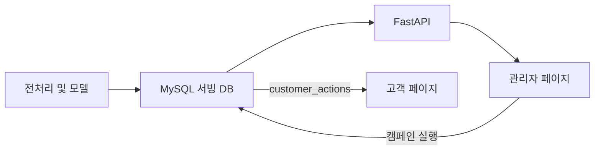

# KKBOX 고객 이탈 예측 프로젝트 발표 가이드

## 1. 발표 핵심 메시지

이 프로젝트는 고객 이탈 확률을 계산하는 데서 끝나지 않고, 예측 결과를 고객 세그먼트와 캠페인 실행으로 연결한 End-to-End 서비스입니다.

발표 내내 다음 흐름을 유지합니다.

```text
과거 행동 데이터
→ 누출 없는 피처 생성
→ 이탈 위험 예측
→ 고객 우선순위 선정
→ 관리자 캠페인 실행
→ 고객 알림 및 혜택 확인
```

## 2. 10~12분 발표 구성

| 순서 | 권장 시간 | 핵심 내용 |
|---|---:|---|
| 문제 정의 | 1분 | 만료 후 30일 내 재구독하지 않는 고객 예측 |
| 데이터와 시점 설계 | 2분 | 2017-01-31 관측 종료, 미래 정보 차단 |
| 전처리·피처 | 2분 | 대용량 로그 청크 처리, 고객·결제·이용 피처 |
| 모델링 | 2분 | LightGBM과 MLP 비교, PR-AUC 중심 평가 |
| 비즈니스 적용 | 2분 | 위험도·가치·생명주기 기반 캠페인 |
| 서비스 시연 | 2~3분 | 관리자 실행 결과가 고객 알림으로 연결 |

## 3. 슬라이드별 발표 내용

### 슬라이드 1. 프로젝트 소개

“KKBOX 고객의 이탈 가능성을 사전에 예측하고, 관리자 캠페인과 고객 혜택까지 연결하는 서비스를 구현했습니다.”

### 슬라이드 2. 문제 정의

- 이탈은 현재 멤버십 만료 후 30일 이내 유효한 재구독이 없는 경우입니다.
- 전체 이탈률은 약 6.39%로 클래스 불균형이 큽니다.
- 모든 고객을 잔존으로 예측하면 Accuracy는 93.6%지만 이탈 고객은 한 명도 찾지 못합니다.
- 따라서 Accuracy보다 PR-AUC, Recall, Precision, F1을 함께 평가했습니다.

### 슬라이드 3. 관측 시점과 데이터 누출 방지

- 예측 시점에 알 수 없는 2월 거래·로그를 피처에 포함하면 성능이 과대평가됩니다.
- 모든 행동 피처를 2017-01-31까지로 제한했습니다.
- 이후 확정된 `is_churn` 라벨을 정답으로 사용했습니다.
- 고객 단위 stratified 70/15/15 분할을 사용했습니다.

| Split | 고객 수 | 이탈률 |
|---|---:|---:|
| Train | 695,051 | 6.3923% |
| Validation | 148,940 | 6.3925% |
| Test | 148,940 | 6.3918% |

### 슬라이드 4. 데이터 처리와 피처 엔지니어링

- `members`: 가입 정보, 가입 기간, 정제 연령
- `transactions`: 거래 수, 자동 갱신률, 취소율, 최근 결제와 만료까지의 기간
- `user_logs`: 최근 7·30·90일 활동일, 재생량, 고유 곡 수, 최근 로그 경과일
- 약 30GB 규모 로그는 청크 방식으로 집계하고 DuckDB SQL 결과와 교차 검증했습니다.
- 최종 Enhanced v2 모델은 57개 피처를 사용합니다.

### 슬라이드 5. 모델 선택과 성능

| 모델 | Test ROC-AUC | Test PR-AUC | Precision | Recall | F1 |
|---|---:|---:|---:|---:|---:|
| LightGBM Enhanced v2 | 0.90356 | 0.58343 | 0.53676 | 0.57826 | 0.55674 |
| MLP | 0.89235 | 0.55990 | 0.53514 | 0.55273 | 0.54379 |

- 최종 모델은 LightGBM Enhanced v2입니다.
- 불균형 데이터에서 양성 클래스 탐지 품질을 더 잘 보여주는 PR-AUC를 주요 지표로 삼았습니다.
- Validation F1 기준 임계값은 `0.270839`입니다.
- 상위 5% 위험 고객군의 Precision은 약 61.1%, Lift는 약 9.55배입니다.

### 슬라이드 6. 비즈니스 적용

예측 확률만으로 대상을 정하지 않고 고객 가치와 생명주기를 함께 사용합니다.

| 생명주기 | 캠페인 | 예시 |
|---|---|---|
| 구독 활성 | Retention | 갱신 안내, 선택적 할인 |
| 갱신 유예기간 | 긴급 갱신 | 결제 오류·만료 안내, 기한 제한 혜택 |
| 장기 만료 | Win-back | 복귀 콘텐츠, 복귀 할인 |

고가치 고객은 보호 우선순위를 높이고, 저가치 고객은 비용이 낮은 알림 중심으로 운영할 수 있습니다.

### 슬라이드 7. 서비스 구조



### 슬라이드 8. 한계와 고도화

- 과거 단일 스냅샷이므로 현재 환경의 성능을 보장하지 않습니다.
- `train_v2` 같은 이후 코호트로 시간 외 검증이 필요합니다.
- 월별 동적 스냅샷과 시계열 피처를 구축하면 조기 예측으로 확장할 수 있습니다.
- 실제 외부 메시지 발송과 전환 이벤트 수집은 구현 범위 밖입니다.
- 캠페인 효과를 확인하려면 대조군을 둔 A/B 테스트가 필요합니다.

## 4. 데모 진행 순서

1. 관리자 페이지에서 운영 요약과 고위험 고객 규모를 보여줍니다.
2. 분석 화면에서 모델 성능, 주요 피처, 세그먼트를 설명합니다.
3. 고객 탐색에서 조건을 적용하고 캠페인 초안에 고객을 추가합니다.
4. 캠페인 실행 화면에서 대상 수와 제외 결과를 확인한 후 실행합니다.
5. 발송 이력에서 생성된 기록을 확인합니다.
6. 해당 고객으로 로그인해 알림과 혜택이 표시되는 것을 확인합니다.

데모 전에 관리자·고객 계정, DB 연결, 대상 고객 ID를 미리 점검합니다.

## 5. 예상 질문과 답변

### 왜 Accuracy를 주요 지표로 사용하지 않았나요?

이탈률이 6.39%라 모든 고객을 잔존으로 예측해도 Accuracy가 약 93.6%입니다. 이 수치는 이탈 고객 탐지력을 보여주지 못하므로 PR-AUC와 Recall을 중심으로 평가했습니다.

### Recall 약 58%면 실무에 사용할 수 있나요?

모든 이탈 고객을 잡는 모델은 아니지만 무작위 선정보다 우선순위를 크게 개선합니다. 특히 상위 5% 위험군의 Lift가 약 9.55배라 제한된 마케팅 예산을 집중하는 랭킹 도구로 의미가 있습니다. 실제 도입 여부는 캠페인 비용과 증분 전환 효과로 판단해야 합니다.

### 왜 딥러닝보다 LightGBM 성능이 좋았나요?

현재 입력은 집계된 정형 피처입니다. 이런 데이터에서는 트리 기반 부스팅이 비선형 관계와 변수 상호작용을 효율적으로 학습합니다. 원시 로그를 시퀀스로 구성한다면 딥러닝의 장점을 추가로 검증할 수 있습니다.

### 2017-01-31로 자른 이유는 무엇인가요?

2월 행동을 피처에 사용하면 이탈 여부가 결정되는 기간의 미래 정보를 보게 됩니다. 실제 예측 상황을 재현하기 위해 관측 가능한 데이터를 1월 말까지로 제한했습니다.

### 임계값은 왜 0.5가 아닌가요?

불균형 데이터에서 0.5는 최적 운영점이라는 보장이 없습니다. Validation 데이터에서 F1이 최대가 되는 `0.270839`를 고정하고 Test와 서비스에 동일하게 적용했습니다.

### 캠페인 효과가 검증됐나요?

아닙니다. 현재 구현은 대상 선정, 캠페인 기록, 고객 알림 연결까지입니다. 실제 효과는 발송·노출·클릭·재구독 이벤트를 수집하고 대조군과 비교해야 측정할 수 있습니다.

## 6. 발표에서 구분해야 할 내용

현재 구현으로 말할 수 있는 것:

- 과거 데이터 기반 이탈 위험 예측
- 관리자 고객 탐색과 캠페인 대상 선정
- 캠페인 실행 기록과 고객 페이지 알림 연결
- 고객의 알림 읽음 처리와 혜택 수령

향후 계획으로만 말해야 하는 것:

- 실제 이메일·푸시 발송
- 캠페인으로 인한 이탈 감소율 또는 매출 증가
- A/B 테스트 결과
- 실시간 예측과 운영 자동화
- 시계열 딥러닝 성능 개선

