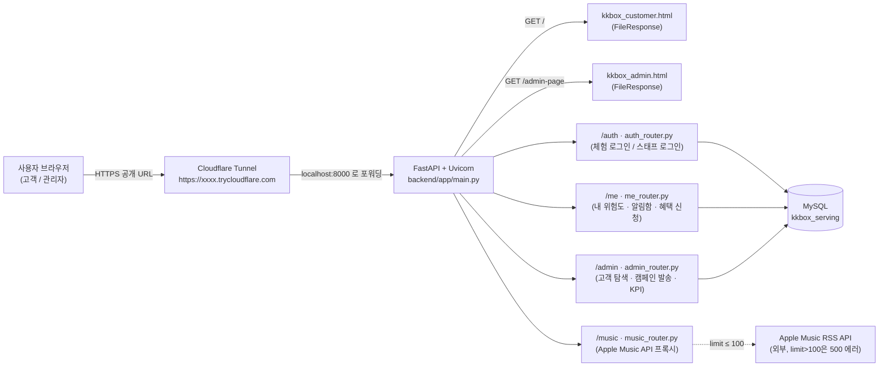
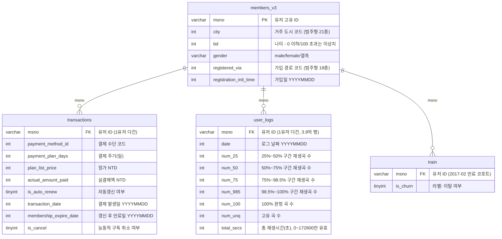
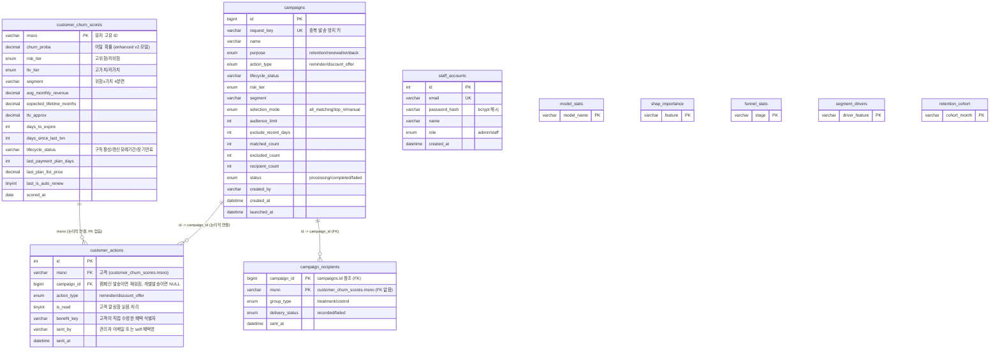

# KKBOX 이탈 예측 서비스 — 통합 가이드 (아키텍처 · ERD · 배포 · 시연 순서 · 트러블슈팅)

> SKN34-2nd-2team · KKBOX Customer Churn Prediction
> GitHub에서 이 파일을 열면 아래 mermaid 다이어그램들이 자동으로 그림으로 렌더링됩니다.

## 목차

1. [프로젝트 개요](#1-프로젝트-개요)
2. [시스템 아키텍처](#2-시스템-아키텍처)
3. [DB ERD](#3-db-erd)
4. [로컬 실행 방법](#4-로컬-실행-방법)
5. [무료 배포 방법 (Cloudflare Tunnel)](#5-무료-배포-방법-cloudflare-tunnel)
6. [발표 시연 순서 (Runbook)](#6-발표-시연-순서-runbook)
7. [트러블슈팅](#7-트러블슈팅)

---

## 1. 프로젝트 개요

KKBOX 실사용자 데이터(회원/결제/청취로그)를 기반으로 이탈(churn) 확률을 예측하고, 그 결과를 **고객용 앱**과 **관리자 대시보드** 양쪽에서 실제 서비스처럼 체험할 수 있게 만든 캡스톤 프로젝트입니다.

- **모델**: LightGBM Enhanced v2 (57 피처) — 이탈확률·위험도(risk_tier)·가치등급(ltv_tier)·세그먼트·생애주기 상태(lifecycle_status)까지 산출
- **고객 앱** (`frontend/kkbox_customer.html`): msno 체험 로그인 → 개인화된 위험도/혜택/쿠폰/결제 화면
- **관리자 대시보드** (`frontend/kkbox_admin.html`): 고객 탐색·캠페인 발송·모델 비교·SHAP·퍼널·리텐션 코호트
- **백엔드** (`backend/app/main.py`): FastAPI 단일 프로세스가 API + 프론트 HTML 서빙까지 전부 담당
- **DB**: MySQL `kkbox_serving` (raw CSV는 들어가지 않음 — 예측 결과 + 참조 테이블만 적재, 자세한 내용은 `DB_ERD_가이드.md` 및 아래 3번 섹션 참고)

---

## 2. 시스템 아키텍처



**포인트 3가지**

- **단일 배포 단위**: FastAPI가 API와 프론트 HTML을 모두 서빙하고(`FileResponse`), `kkbox_customer.html`은 `const API_BASE = window.location.origin;`을 쓰기 때문에 **CORS 설정이 전혀 필요 없다** — Cloudflare Tunnel처럼 URL이 매번 바뀌는 환경에도 코드 수정 없이 그대로 배포된다.
- **DB는 MySQL 하나**: `kkbox_serving`. raw CSV(members/transactions/user_logs/train)는 여기 들어가지 않고, 모델이 계산한 결과 + 대시보드 참조 테이블 + 계정만 올라간다.
- **Apple Music API 제약**: `limit>100`이면 Apple 서버가 100% 재현되는 HTTP 500을 반환한다는 걸 직접 테스트로 확인해서, 내부 호출·공개 파라미터 상한 모두 100으로 고정해뒀다 (7번 트러블슈팅 참고).

---

## 3. DB ERD

### 3-1. 원본 raw 데이터 (Kaggle CSV, MySQL에는 적재하지 않음)



| 파일 | 크기 | 행 수 | 비고 |
|---|---|---|---|
| members_v3.csv | 약 428MB | 약 676만 | 유저 프로필 (1행 = 1유저) |
| transactions.csv | 약 1.7GB | 약 2,155만 | 결제 이력 (1유저 다건) |
| user_logs.csv | 약 30GB | 약 3.92억 | 일별 청취 로그 (가장 큼) |
| train.csv | 약 47MB | 약 99만 | 이탈 라벨 (2017-02 만료 코호트) |

관측 컷오프는 전부 **2017-01-31**로 고정 (라벨 결정 시점 이후 데이터는 피처 집계에서 제외 — 시간 누수 방지).

### 3-2. 서빙용 MySQL DB — `kkbox_serving`



`customer_churn_scores`가 핵심 테이블(전체 고객 약 99만 msno, 1인 1행). `customer_actions`/`campaigns`/`campaign_recipients` 3개는 **발표 데모 직전에 초기화(TRUNCATE)해서 쓰는 테이블**이고(6번 참고), 나머지 5개(`model_stats`~`retention_cohort`)는 대시보드 참조용 정적 테이블입니다. 전체 컬럼 상세는 `DB_ERD_가이드.md`와 큰 화면 버전인 `db_erd_full.html`(Mermaid 인라인, 브라우저로 바로 열람 가능)에도 정리되어 있습니다.

---

## 4. 로컬 실행 방법

```bash
# DB 적재만 다시 하고 싶을 때 (모델/피처는 이미 생성되어 있는 상태)
cd backend
python scoring/build_scoring_table.py
python scoring/export_reference_tables.py
python scoring/load_to_mysql.py

# API 서버 실행
uvicorn app.main:app --reload --port 8000
```

- 고객 사이트: `http://localhost:8000/`
- 관리자 사이트: `http://localhost:8000/admin-page`
- Swagger UI: `http://localhost:8000/docs`
- MySQL 접속 정보는 `.env` (없으면 `backend/db.py`의 기본값: `127.0.0.1:3306`, `root`, DB명 `kkbox_serving`) 사용

---

## 5. 무료 배포 방법 (Cloudflare Tunnel)

로컬에서 돌아가는 FastAPI를 코드 수정 없이 그대로 공개 HTTPS URL로 노출하는 방법입니다 (Quick Tunnel, 계정 가입 불필요, 완전 무료).

1. **cloudflared 설치** (Windows): [MSI 다운로드](https://github.com/cloudflare/cloudflared/releases/latest/download/cloudflared-windows-amd64.msi) 후 설치, `cloudflared --version`으로 확인
2. **백엔드 먼저 실행**: `backend` 폴더에서 `uvicorn app.main:app --port 8000`
3. **터널 실행** (새 터미널): `cloudflared tunnel --url http://localhost:8000`
4. 터미널에 뜨는 `https://무작위단어-무작위단어.trycloudflare.com` 형태의 URL이 공개 접속 주소 — 고객 사이트는 이 URL 그대로, 관리자 사이트는 `.../admin-page`

**주의할 점**

- Quick Tunnel URL은 **재시작할 때마다 랜덤하게 바뀐다** — 발표 당일 다시 실행하면 이전 URL은 더 이상 유효하지 않으므로, 그날 실행해서 나온 새 URL을 그때 공유해야 함
- 공식 SLA 없음, 동시 요청 200개 제한 — 팀 발표용 데모 규모에는 문제 없음
- 프론트 HTML만 수정한 경우 새로고침만으로 반영됨(터널/서버 재시작 불필요). 백엔드(.py) 수정은 uvicorn만 재시작하면 되고, cloudflared 터미널은 그대로 둬도 됨(같은 포트로 계속 포워딩하기 때문)

---

## 6. 발표 시연 순서 (Runbook)

### 6-0. 시연 ~1시간 전 준비

**① 데모 상태 초기화** — 이전에 눌러본 리마인드 발송/캠페인 기록을 지워 깨끗한 상태로 시작합니다. `customer_churn_scores`(모델 예측 결과)와 `staff_accounts`는 건드리지 않고, 발송 이력 3개 테이블만 비웁니다.

```sql
USE kkbox_serving;
TRUNCATE TABLE customer_actions;
TRUNCATE TABLE campaign_recipients;
TRUNCATE TABLE campaigns;
```

> 순서가 중요합니다 — `campaign_recipients`가 `campaigns`를 FK로 참조하므로 `campaigns`보다 먼저 비워야 합니다.

**② 세그먼트별 데모용 msno 확보** — 관리자 홈페이지 고객 탐색 탭에서 위험도 × 월매출 세그먼트 필터(또는 새로 복구된 msno 검색)로 4개 세그먼트(고위험/고가치, 고위험/저가치, 저위험/고가치, 저위험/저가치) 각각 msno 1개씩 미리 뽑아 메모해두면 시연 중 헤매지 않습니다.

**③ 서버·터널 기동**

```bash
# 터미널 1
cd backend && uvicorn app.main:app --port 8000

# 터미널 2
cloudflared tunnel --url http://localhost:8000
```

발급된 URL로 고객/관리자 페이지 모두 한 번씩 열어 정상 로딩되는지 확인.

### 6-1. 시연 흐름 (제안)

1. **고객 사이트** — 미리 준비한 msno로 체험 로그인 → "내 위험도" 화면에서 이탈확률·위험도·LTV 등급 확인
2. **혜택 탭** — 세그먼트별로 자동 매칭된 쿠폰(할인/크레딧/적립/체험) 확인, 콘서트 응모권·연간 등급·갱신 리워드 등 자기신청형 혜택도 함께 보여주기
3. **결제 탭** — 실제 결제 팝업에서 할인/크레딧이 적용되는 것까지 시연 (고위험 두 세그먼트는 결제액이 실제로 바뀌는 걸 보여주면 임팩트 있음)
4. **관리자 사이트** — 스태프 로그인 → 고객 탐색 탭에서 msno 검색으로 방금 봤던 고객을 바로 다시 찾기
5. **캠페인 발송** — 위험군/세그먼트 조건으로 대상 추출 → 리마인드 또는 할인 오퍼 발송 시연
6. **대시보드** — 모델 비교(AUC/PR-AUC/F1), SHAP 중요도, 가입 퍼널, 세그먼트별 이탈 동인, 리텐션 코호트 순으로 KPI 탭 순회

### 6-2. 시연 후

다음 발표/리허설을 위해 다시 초기화하려면 6-0의 ①번 SQL을 재실행하면 됩니다.

---

## 7. 트러블슈팅

프로젝트 전 구간에서 실제로 겪었던 이슈와 해결 과정은 **[`TROUBLESHOOTING.md`](./TROUBLESHOOTING.md)**에 데이터/모델링(A) · 백엔드(B) · 프론트엔드(C) 세 파트로 정리되어 있습니다. 그중 발표 전 팀 확인이 필요한 미해결 항목:

- **A-9 / A-10**: 대시보드(`streamlit_app`)와 `models/model_comparison.csv`의 일부 수치가 실제 서빙 모델(enhanced v2)·노트북 실행 결과와 다르게 나타남 — 발표 자료 수치는 노트북이 직접 출력한 값을 신뢰값으로 사용 중
- **C-7**: 세션 중 일부 프론트 작업(다크/라이트 대비, 플레이어 컨트롤, 알림 패널, win-back 카드, 관리자 msno 검색)이 미커밋 상태에서 사라졌던 정황 → **오늘 기준 재확인 결과, 셔플/반복/탐색바, 알림 패널(`NotificationPanel`), win-back 카드, 라이트 테마 모두 현재 파일에 정상적으로 존재함을 확인**했습니다. 다만 원인이 된 "미커밋 변경이 git 작업 중 되돌아감" 리스크는 여전하므로, **작업 후 바로 커밋하는 습관**은 계속 필요합니다.

아래는 `TROUBLESHOOTING.md` 작성 이후(발표 준비 마무리 단계)에 추가로 발견·수정한 항목입니다.

### D-1. 모델 비교 노트북이 실제 배포 모델이 아닌 구버전을 비교
**문제**: `modeling/03_model_comparison.ipynb`가 LightGBM 비교 시 실제 배포된 `lightgbm_enhanced_v2.txt`(57 피처)가 아니라, 피처 강화 이전의 `lightgbm_final.txt`(40 피처)를 불러와 평가하고 있었다.
**해결**: LightGBM 행만 `model_table_enhanced_v2.csv`/`lightgbm_enhanced_v2.txt`를 따로 불러와 평가하도록 수정(다른 4개 모델은 기존 베이스라인 피처셋 그대로 유지 — 의도적인 것임을 노트북에 명시).

### D-2. "최신음악" 탭이 항상 비어서 뜸
**문제**: Apple Music RSS API에 `limit=150`/`200`으로 요청하면 **100% 재현되는 HTTP 500**이 발생한다는 것을 실제 API 호출로 확인(이전에는 "가끔 타임아웃"으로 잘못 진단했던 이슈).
**해결**: `music_router.py`의 `/chart`, `/new-releases` 두 엔드포인트 모두 내부 Apple API 호출과 공개 파라미터 상한을 `limit=100`으로 고정.

### D-3. 세그먼트 쿠폰이 화면엔 보이는데 결제에는 적용 안 됨
**문제**: 결제 팝업의 할인/크레딧 로직이 `lifecycle_status === "장기만료"`(win-back 대상)에만 걸려 있어서, 구독 중인 고위험 고객은 혜택 탭에 쿠폰이 뜨는데도 실제 결제 시엔 적용되지 않았다.
**해결**: 결제 로직을 `lifecycle_status`가 아닌 `segment`(`COUPON_RULES[risk.segment]`) 기준으로 통일 — 별도의 재구독 유도 배너(장기만료 전용)는 그대로 유지.

### D-4. 구독이 끊긴 고객의 요금제 목록에 "✓이용중" 태그가 남아있음
**문제**: 요금제 목록의 "이용중" 표시가 "마지막으로 결제했던 요금제"인지만 확인하고, 그 구독이 지금도 살아있는지는 확인하지 않았다.
**해결**: `lifecycle_status`가 구독활성/갱신유예기간일 때만 "이용중"으로 표시하도록 `hasActiveSubscription` 가드 추가.

### D-5. 관리자 고객 탐색의 msno 검색창 복구
**문제**: (C-7과 동일 계열) 고객 탐색 탭에서 msno로 특정 고객을 바로 찾는 검색 기능이 화면에서 빠져 있었다.
**해결**: 검색창을 복구하고, msno 검색 중에는 위험도/세그먼트/생애주기 필터를 흐리게 비활성화 + 서버 요청에서도 제외해 "검색했는데 필터에 안 걸려서 안 보임"으로 혼동하지 않도록 함(백엔드 `/admin/customers`는 원래부터 msno 우선 검색을 지원하고 있었음). 검색어는 300ms 디바운스 적용.

### 미해결 (발표 전 참고)

- **`analytics/09_survival_analysis.ipynb`의 `lifelines` import 실패**: `pip install lifelines==0.30.3` 안내까지는 드렸으나 재현 여부 확인이 안 된 상태. 커널이 pip과 다른 Python 환경을 보고 있을 가능성이 있어, `!{sys.executable} -m pip install lifelines==0.30.3` 로 노트북 커널과 동일한 환경에 설치했는지 다시 확인 필요.

---

*이 문서는 `DB_ERD_가이드.md`, `db_erd_full.html`, `TROUBLESHOOTING.md`와 함께 봐야 전체 그림이 맞습니다.*
